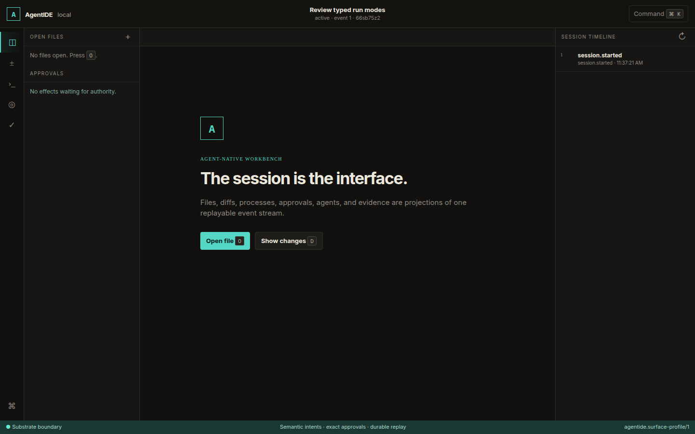

# AgentIDE

AgentIDE is a local coding workbench where humans and agents share one durable session. Files,
diffs, terminal activity, model actions, evidence, and approval decisions remain visible and
replayable instead of disappearing inside a chat transcript.



AgentIDE is a developer preview for Linux x86_64. The CLI, model-backed terminal UI,
projection-only terminal UI, and loopback browser all use the same session record.

## Install AgentIDE

Install the latest stable GitHub Release with the first-party installer:

```bash
curl --proto '=https' --tlsv1.2 -LsSf https://github.com/beyond10x/agentide/releases/latest/download/agentide-installer.sh | sh
```

The installer resolves an immutable release, downloads its Linux x86_64 archive and
`SHA256SUMS`, verifies exactly one matching checksum, and installs `agentide` into
`~/.local/bin` without sudo. If that directory is not on `PATH`, it prints the required next step.

```bash
agentide --version
```

## Run your first coding session

Run these commands from the workspace you want AgentIDE to use. The endpoint, exact model, and
credential source are intentionally explicit; AgentIDE does not choose a provider or search for
credentials.

```bash
export AGENTIDE_BASE_URL="https://api.example/v1"
export AGENTIDE_MODEL="model-id"
export MODEL_API_KEY="your-api-key"

agentide run \
  --objective "Implement and verify the change" \
  --api-key-env MODEL_API_KEY
```

`agentide run` adopts the current directory, creates a durable session, prints its ID and resume
command, and opens the model-backed TUI. The session remains available after the TUI exits or the
model loop fails. The key is read from `MODEL_API_KEY` for each request and is never written to the
session journal.

Inside the TUI, press `i` to prompt the agent, `Ctrl+K` for the command palette, `Ctrl+P` to open a
file, and `Tab` to move between regions. When an effect needs approval, `y` or `n` resolves the exact
plan displayed by the gate.

## Choose a running mode

| Mode | Start | Best for |
| --- | --- | --- |
| Model-backed TUI | `agentide run --api-key-env MODEL_API_KEY` | Interactive agent-assisted coding |
| Projection-only TUI | `agentide run` | Inspecting and operating a session without a model |
| JSON CLI | `agentide session start`, then `agentide intent ...` | Scripts and agent tool adapters |
| Local browser | `agentide serve --session <id>` | A loopback visual view of the same session |
| Hosted DevCenter | Environment-provided URL | Authenticated composed deployments; no public self-service endpoint |

For an existing session, attach directly with `agentide tui --session <id>`. Model-backed `run` and
`tui` require both `AGENTIDE_BASE_URL` and `AGENTIDE_MODEL`; supplying only one is an error. Omitting
both selects projection-only mode. See the generated [running-mode reference](docs/running-modes.md)
for the exact implementation, attachment, availability, and ESS surface of every realization.

The JSON workflow remains available when a caller needs structured output:

```bash
agentide session start --workspace . --objective "Inspect the change"
agentide snapshot --session <id>
agentide intent call --session <id> code_read --input '{"path":"src/lib.rs"}'
```

The browser is loopback-only. Start `agentide serve --session <id>`, then open
`http://127.0.0.1:7788/`. It presents the durable projection but does not run a model loop.

The root uses the compatibility Vanilla DOM renderer. The same live session can be compared through
`/renderers/vanilla/` and `/renderers/vue/`. Both targets accept the released renderer frame and
event contracts and emit typed semantic actions; HTTP, polling, routing, authentication, storage,
and sockets remain in the browser host. The Vue target also exports an
`AgentIdeVueWorkbench` composition shell with named regions for host-owned editors, diffs,
terminals, and inspectors. It owns layout and landmarks without acquiring access to a host API.

## Install the latest source with Cargo

If you deliberately want the newest source from `main` and have a Rust toolchain, install directly
from GitHub:

```bash
cargo install --git https://github.com/beyond10x/agentide --locked agentide-cli
```

This command compiles the current `main`, which may be newer than the latest stable GitHub Release.
It does not select a release tag. AgentIDE is not published to crates.io, so
`cargo install agentide-cli` is not a supported command. Use the installer above when you want the
latest stable prebuilt binary.

## Why AgentIDE is built on ESS

[ESS](https://github.com/beyond10x/ess) turns AgentIDE's coding model into validated intermediate
representation and generated contracts. That matters to a user because:

- an action such as `code_read`, `code_edit`, or `code_verify` keeps the same meaning across CLI,
  TUI, browser, and hosted surfaces;
- the model sees typed semantic actions rather than being allowed to invent executables,
  credentials, destinations, or policy;
- effectful work is previewed as an exact digest-bound plan before approval;
- sessions and evidence can be replayed against the same declared behavior;
- the generated running-mode reference cannot silently disagree with the executable specification.

Harness drives the model loop and Substrate supplies guarded workspace implementations. Service SDK
and Eventlog provide the generated hosted form without introducing a second AgentIDE-specific
service or persistence model.

## Safety model

Session state lives under `${XDG_STATE_HOME:-$HOME/.local/state}/agentide`, outside the target
workspace. A model request cannot select a driver, executable, credential, destination, or policy.
Missing Substrate facts, bindings, profiles, approvals, or recovery facts produce named refusals;
AgentIDE does not fall back to unconfined host effects.

Mutating JSON intents use two phases: preview the exact plan, grant its SHA-256 digest, and resume
with the same input. The TUI presents the same approval boundary interactively. Model conversations
and credential values are not written to the AgentIDE journal.

## Learn more

- [Harness TUI guide](docs/harness-tui.md) — model wires, credential sources, budgets, and keys
- [Running modes](docs/running-modes.md) — generated realization reference
- [Architecture](docs/architecture.md) — component and ownership boundaries
- [Keyboard interface](docs/keyboard-interface.md) — shared surface operations
- [`spec/agentide/`](spec/agentide/) — executable ESS specification
- [`contracts/`](contracts/) — stable intent, binding, presentation, and wire contracts

Contributors can run the complete repository gate with `cargo xtask gate`. After changing ESS or
Service SDK definitions, regenerate only through the repository-owned xtask commands described in
[AGENTS.md](AGENTS.md).

<!-- b10x-docs:start -->
## Documentation

[AgentIDE documentation](https://beyond10x.github.io/docs/agentide/) · [Start](https://beyond10x.github.io/) · [Ecosystem](https://beyond10x.github.io/ecosystem/) · [Impact](https://beyond10x.github.io/changes/) · [Releases](https://beyond10x.github.io/releases/)
<!-- b10x-docs:end -->
