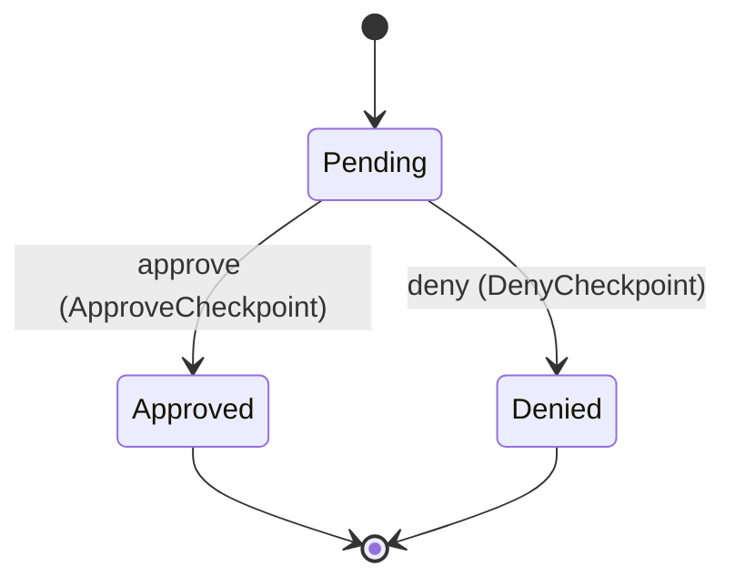
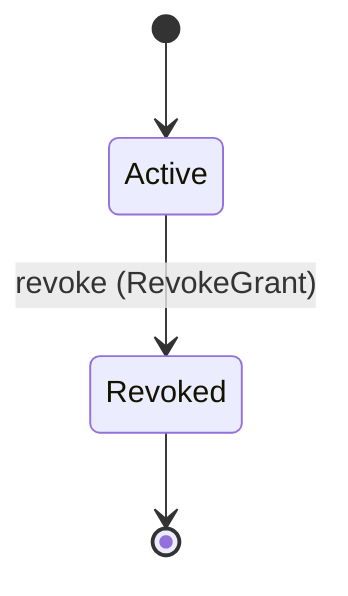
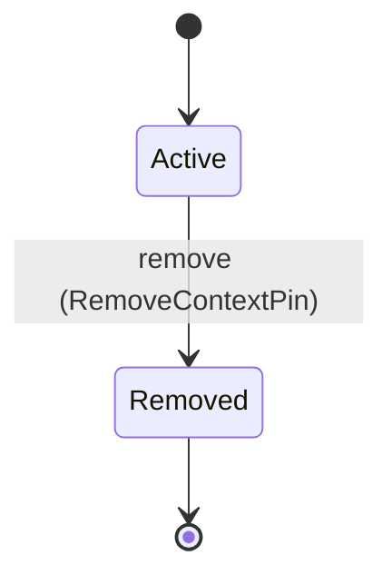

<!--
generated from agentide v1
model digest 360a1e3f4110754181c30d72530c91ae4344a5f5d4c3aff968bda22d67ca12f3
contract digest bb0512dbd08f6b8b79d4ee19920478e38e93af3d98ed63ba40c8dbb38272c220
do not edit: regenerate with `ess generate`
-->

# Session coordination

Durable hosted collaboration references stored by Service SDK without project file bytes.

`agentide.coordination` is one of agentide's bounded contexts. [Back to the index](../index.md).

## Types

### `CheckpointId`

`agentide.coordination.CheckpointId` wraps `String` and is not interchangeable with one: the whole value of naming it separately is the crossings the model then refuses.

### `ContextKind`

`agentide.coordination.ContextKind` is one of `Editor`, `DiffHunk`, `Terminal`, `Process` and `Evidence`.

### `ContextPinId`

`agentide.coordination.ContextPinId` wraps `String` and is not interchangeable with one: the whole value of naming it separately is the crossings the model then refuses.

### `Digest`

`agentide.coordination.Digest` wraps `String` and is not interchangeable with one: the whole value of naming it separately is the crossings the model then refuses.

### `GrantId`

`agentide.coordination.GrantId` wraps `String` and is not interchangeable with one: the whole value of naming it separately is the crossings the model then refuses.

### `GrantRisk`

`agentide.coordination.GrantRisk` is one of `Low` and `Medium`.

### `IntentRef`

`agentide.coordination.IntentRef` wraps `String` and is not interchangeable with one: the whole value of naming it separately is the crossings the model then refuses.

### `OpaqueRef`

`agentide.coordination.OpaqueRef` wraps `String` and is not interchangeable with one: the whole value of naming it separately is the crossings the model then refuses.

### `PathPrefix`

`agentide.coordination.PathPrefix` wraps `String` and is not interchangeable with one: the whole value of naming it separately is the crossings the model then refuses.

### `SubjectRef`

`agentide.coordination.SubjectRef` wraps `String` and is not interchangeable with one: the whole value of naming it separately is the crossings the model then refuses.

## Entities

An entity is what this context is about: something with an identity that outlives any one request, a shape, and a lifecycle. The lifecycle is exhaustive — a move that is not drawn below is a move this specification does not permit, and that is the only way it says so. Every move is labelled with the command that takes it, because a move nothing can trigger is refused rather than drawn.

### `ApprovalCheckpoint`

`agentide.coordination.ApprovalCheckpoint`.

An instance is identified by `checkpoint_id`, a `agentide.coordination.CheckpointId`. The name is part of the model and not a convention: a view projects the identity under that name, so a projection inventing its own would disagree with the view.

It holds:

- `session_id` — `agentide.session.SessionId`
- `attempt_ref` — `agentide.coordination.OpaqueRef`
- `plan_digest` — `agentide.coordination.Digest`
- `checkpoint_ref` — `agentide.coordination.OpaqueRef`
- `owner` — `String`
- `scopes` — `agentide.session.SessionScopes`

It declares no relation to another entity, and no other entity names it.

No invariant is declared, so nothing here constrains an instance at rest.

Its state is a `agentide.coordination.ApprovalCheckpoint.State`, one of `Approved`, `Denied` and `Pending`. That enum is synthesised from the lifecycle rather than declared beside it, so the states a view's filter compares and the states drawn below cannot disagree.

An instance is created in `Pending`. `Approved` and `Denied` are terminal, so an instance may rest there forever. That is declared rather than inferred from having no way out: an entity that cannot leave a state is either finished or stuck, and only its author knows which.

Each move is taken by a declared command outcome, and a move nothing takes is refused as `missing_causation` rather than left as a state change nobody can trigger:

- `approve` — taken by `agentide.coordination.ApproveCheckpoint` on its `approved` outcome
- `deny` — taken by `agentide.coordination.DenyCheckpoint` on its `denied` outcome

An instance is brought into existence by `agentide.coordination.RecordApprovalCheckpoint` on its `recorded` outcome.

Illegal transitions are illegal by absence: no rule forbids them, there is simply no arrow, because a rule would be a second place for the same truth to live. A diagram cannot show an absence, so the pairs it does not connect are listed here, derived from the same transitions — anything named below is a move this specification does not permit.

- `Approved` may not become `Denied`
- `Approved` may not become `Pending`
- `Denied` may not become `Approved`
- `Denied` may not become `Pending`

One view projects it: [`ApprovalCheckpointSnapshot`](#approvalcheckpointsnapshot).

### `AuthorityGrant`

`agentide.coordination.AuthorityGrant`.

An instance is identified by `grant_id`, a `agentide.coordination.GrantId`. The name is part of the model and not a convention: a view projects the identity under that name, so a projection inventing its own would disagree with the view.

It holds:

- `session_id` — `agentide.session.SessionId`
- `grantee` — `agentide.coordination.SubjectRef`
- `allowed_intents` — `List<agentide.coordination.IntentRef>`
- `path_prefixes` — `List<agentide.coordination.PathPrefix>`
- `maximum_risk` — `agentide.coordination.GrantRisk`
- `expires_at` — `Optional<String>`, which may be absent
- `revision` — `Integer`
- `owner` — `String`
- `scopes` — `agentide.session.SessionScopes`

It declares no relation to another entity, and no other entity names it.

No invariant is declared, so nothing here constrains an instance at rest.

Its state is a `agentide.coordination.AuthorityGrant.State`, one of `Active` and `Revoked`. That enum is synthesised from the lifecycle rather than declared beside it, so the states a view's filter compares and the states drawn below cannot disagree.

An instance is created in `Active`. `Revoked` is terminal, so an instance may rest there forever. That is declared rather than inferred from having no way out: an entity that cannot leave a state is either finished or stuck, and only its author knows which.

Each move is taken by a declared command outcome, and a move nothing takes is refused as `missing_causation` rather than left as a state change nobody can trigger:

- `revoke` — taken by `agentide.coordination.RevokeGrant` on its `revoked` outcome

An instance is brought into existence by `agentide.coordination.CreateGrant` on its `created` outcome.

Illegal transitions are illegal by absence: no rule forbids them, there is simply no arrow, because a rule would be a second place for the same truth to live. A diagram cannot show an absence, so the pairs it does not connect are listed here, derived from the same transitions — anything named below is a move this specification does not permit.

- `Revoked` may not become `Active`

One view projects it: [`GrantSnapshot`](#grantsnapshot).

### `ContextPin`

`agentide.coordination.ContextPin`.

An instance is identified by `pin_id`, a `agentide.coordination.ContextPinId`. The name is part of the model and not a convention: a view projects the identity under that name, so a projection inventing its own would disagree with the view.

It holds:

- `session_id` — `agentide.session.SessionId`
- `kind` — `agentide.coordination.ContextKind`
- `reference` — `agentide.coordination.OpaqueRef`
- `start_line` — `Optional<Integer>`, which may be absent
- `end_line` — `Optional<Integer>`, which may be absent
- `sha256` — `agentide.coordination.Digest`
- `owner` — `String`
- `scopes` — `agentide.session.SessionScopes`

It declares no relation to another entity, and no other entity names it.

No invariant is declared, so nothing here constrains an instance at rest.

Its state is a `agentide.coordination.ContextPin.State`, one of `Active` and `Removed`. That enum is synthesised from the lifecycle rather than declared beside it, so the states a view's filter compares and the states drawn below cannot disagree.

An instance is created in `Active`. `Removed` is terminal, so an instance may rest there forever. That is declared rather than inferred from having no way out: an entity that cannot leave a state is either finished or stuck, and only its author knows which.

Each move is taken by a declared command outcome, and a move nothing takes is refused as `missing_causation` rather than left as a state change nobody can trigger:

- `remove` — taken by `agentide.coordination.RemoveContextPin` on its `removed` outcome

An instance is brought into existence by `agentide.coordination.PinContext` on its `pinned` outcome.

Illegal transitions are illegal by absence: no rule forbids them, there is simply no arrow, because a rule would be a second place for the same truth to live. A diagram cannot show an absence, so the pairs it does not connect are listed here, derived from the same transitions — anything named below is a move this specification does not permit.

- `Removed` may not become `Active`

One view projects it: [`ContextPinSnapshot`](#contextpinsnapshot).

## Views

A view is what the outside world is promised it can observe. Each one says which instances it contains and how soon it reflects a command that has already returned, because "you can read this" without "how soon" is the promise every flaky suite is built on.

### `ApprovalCheckpointSnapshot`

`agentide.coordination.ApprovalCheckpointSnapshot`.

It reads [`ApprovalCheckpoint`](#approvalcheckpoint).

It contains every instance of that entity: no filter narrows it, which is a decision somebody made and not a line somebody omitted.

It exposes:

- `checkpoint_id` — `agentide.coordination.CheckpointId`
- `session_id` — `agentide.session.SessionId`
- `attempt_ref` — `agentide.coordination.OpaqueRef`
- `plan_digest` — `agentide.coordination.Digest`
- `checkpoint_ref` — `agentide.coordination.OpaqueRef`
- `owner` — `String`
- `scopes` — `agentide.session.SessionScopes`
- `state` — `agentide.coordination.ApprovalCheckpoint.State`

It declares no order, so the rows come back in whatever order the implementation has, and two reads may disagree.

**Read-your-writes**: it is current the moment the command that changed it returns. A caller that has just created an invoice and cannot see it in here has been told a lie about what it did.

A generated scenario asserts it once, immediately after the command: a view promising this and not keeping the promise has to fail the suite rather than be retried until it passes.

### `ContextPinSnapshot`

`agentide.coordination.ContextPinSnapshot`.

It reads [`ContextPin`](#contextpin).

It contains every instance of that entity: no filter narrows it, which is a decision somebody made and not a line somebody omitted.

It exposes:

- `pin_id` — `agentide.coordination.ContextPinId`
- `session_id` — `agentide.session.SessionId`
- `kind` — `agentide.coordination.ContextKind`
- `reference` — `agentide.coordination.OpaqueRef`
- `start_line` — `Optional<Integer>`, which may be absent
- `end_line` — `Optional<Integer>`, which may be absent
- `sha256` — `agentide.coordination.Digest`
- `owner` — `String`
- `scopes` — `agentide.session.SessionScopes`
- `state` — `agentide.coordination.ContextPin.State`

It declares no order, so the rows come back in whatever order the implementation has, and two reads may disagree.

**Read-your-writes**: it is current the moment the command that changed it returns. A caller that has just created an invoice and cannot see it in here has been told a lie about what it did.

A generated scenario asserts it once, immediately after the command: a view promising this and not keeping the promise has to fail the suite rather than be retried until it passes.

### `GrantSnapshot`

`agentide.coordination.GrantSnapshot`.

It reads [`AuthorityGrant`](#authoritygrant).

It contains every instance of that entity: no filter narrows it, which is a decision somebody made and not a line somebody omitted.

It exposes:

- `grant_id` — `agentide.coordination.GrantId`
- `session_id` — `agentide.session.SessionId`
- `grantee` — `agentide.coordination.SubjectRef`
- `allowed_intents` — `List<agentide.coordination.IntentRef>`
- `path_prefixes` — `List<agentide.coordination.PathPrefix>`
- `maximum_risk` — `agentide.coordination.GrantRisk`
- `expires_at` — `Optional<String>`, which may be absent
- `revision` — `Integer`
- `owner` — `String`
- `scopes` — `agentide.session.SessionScopes`
- `state` — `agentide.coordination.AuthorityGrant.State`

It declares no order, so the rows come back in whatever order the implementation has, and two reads may disagree.

**Read-your-writes**: it is current the moment the command that changed it returns. A caller that has just created an invoice and cannot see it in here has been told a lie about what it did.

A generated scenario asserts it once, immediately after the command: a view promising this and not keeping the promise has to fail the suite rather than be retried until it passes.

## Commands

### `ApproveCheckpoint`

`agentide.coordination.ApproveCheckpoint`, shown to a person as "Approve exact checkpoint" and called `approval-checkpoint-approve` on the wire.

It takes:

- `session_id` — `agentide.session.SessionId`
- `request_id` — `agentide.session.RequestId`
- `checkpoint_id` — `agentide.coordination.CheckpointId`

It has three outcomes.

**`approved`** — The default branch, taken when no other outcome's condition matched. It moves a `agentide.coordination.ApprovalCheckpoint` from `Pending` to `Approved`, along the declared move `approve`. The instance is the one named by the input field `checkpoint_id`. It emits `agentide.coordination.ApprovalCheckpointApproved`. A test reaches it by constructing an input that satisfies no other outcome's condition.

**`wrong-state`** — Taken when the subject is resting in a state none of this command's moves start from — a `agentide.coordination.ApprovalCheckpoint` in `Approved` and `Denied`, which is what is left of the lifecycle once this command's own moves are taken away. The document lists none of it. No entity in this specification changes. It reports `agentide.coordination.CoordinationStateConflict`, carrying `state`. It emits nothing. A test reaches it by driving an instance into one of those states and then issuing the command, because no input selects this branch.

**`refused`** — Decided outside the input: durable state is unavailable. No predicate over the input reaches this branch, and saying `when: false` instead would have claimed it is unreachable, which is a different and false statement. No entity in this specification changes. It reports `agentide.coordination.CoordinationRefusal`, carrying `code`, `message` and `retryable`. It emits nothing. A test reaches it by injecting the declared fault, because no input can.

### `CreateGrant`

`agentide.coordination.CreateGrant`, shown to a person as "Create authority grant" and called `grant-create` on the wire.

It takes:

- `session_id` — `agentide.session.SessionId`
- `request_id` — `agentide.session.RequestId`
- `grantee` — `agentide.coordination.SubjectRef`
- `allowed_intents` — `List<agentide.coordination.IntentRef>`
- `path_prefixes` — `List<agentide.coordination.PathPrefix>`
- `maximum_risk` — `agentide.coordination.GrantRisk`
- `expires_at` — `Optional<String>`, which may be absent
- `revision` — `Integer`

It has two outcomes.

**`created`** — The default branch, taken when no other outcome's condition matched. It creates a `agentide.coordination.AuthorityGrant`, which starts in `Active`. The new instance's identity is published as `grant_id` on `agentide.coordination.GrantCreated`. It emits `agentide.coordination.GrantCreated`. A test reaches it by constructing an input that satisfies no other outcome's condition.

**`refused`** — Decided outside the input: authority or durable state is unavailable. No predicate over the input reaches this branch, and saying `when: false` instead would have claimed it is unreachable, which is a different and false statement. No entity in this specification changes. It reports `agentide.coordination.CoordinationRefusal`, carrying `code`, `message` and `retryable`. It emits nothing. A test reaches it by injecting the declared fault, because no input can.

### `DenyCheckpoint`

`agentide.coordination.DenyCheckpoint`, shown to a person as "Deny exact checkpoint" and called `approval-checkpoint-deny` on the wire.

It takes:

- `session_id` — `agentide.session.SessionId`
- `request_id` — `agentide.session.RequestId`
- `checkpoint_id` — `agentide.coordination.CheckpointId`

It has three outcomes.

**`denied`** — The default branch, taken when no other outcome's condition matched. It moves a `agentide.coordination.ApprovalCheckpoint` from `Pending` to `Denied`, along the declared move `deny`. The instance is the one named by the input field `checkpoint_id`. It emits `agentide.coordination.ApprovalCheckpointDenied`. A test reaches it by constructing an input that satisfies no other outcome's condition.

**`wrong-state`** — Taken when the subject is resting in a state none of this command's moves start from — a `agentide.coordination.ApprovalCheckpoint` in `Approved` and `Denied`, which is what is left of the lifecycle once this command's own moves are taken away. The document lists none of it. No entity in this specification changes. It reports `agentide.coordination.CoordinationStateConflict`, carrying `state`. It emits nothing. A test reaches it by driving an instance into one of those states and then issuing the command, because no input selects this branch.

**`refused`** — Decided outside the input: durable state is unavailable. No predicate over the input reaches this branch, and saying `when: false` instead would have claimed it is unreachable, which is a different and false statement. No entity in this specification changes. It reports `agentide.coordination.CoordinationRefusal`, carrying `code`, `message` and `retryable`. It emits nothing. A test reaches it by injecting the declared fault, because no input can.

### `PinContext`

`agentide.coordination.PinContext`, shown to a person as "Pin context reference" and called `context-pin` on the wire.

It takes:

- `session_id` — `agentide.session.SessionId`
- `request_id` — `agentide.session.RequestId`
- `kind` — `agentide.coordination.ContextKind`
- `reference` — `agentide.coordination.OpaqueRef`
- `start_line` — `Optional<Integer>`, which may be absent
- `end_line` — `Optional<Integer>`, which may be absent
- `sha256` — `agentide.coordination.Digest`

It has two outcomes.

**`pinned`** — The default branch, taken when no other outcome's condition matched. It creates a `agentide.coordination.ContextPin`, which starts in `Active`. The new instance's identity is published as `pin_id` on `agentide.coordination.ContextPinned`. It emits `agentide.coordination.ContextPinned`. A test reaches it by constructing an input that satisfies no other outcome's condition.

**`refused`** — Decided outside the input: the reference cannot be admitted or durable state is unavailable. No predicate over the input reaches this branch, and saying `when: false` instead would have claimed it is unreachable, which is a different and false statement. No entity in this specification changes. It reports `agentide.coordination.CoordinationRefusal`, carrying `code`, `message` and `retryable`. It emits nothing. A test reaches it by injecting the declared fault, because no input can.

### `RecordApprovalCheckpoint`

`agentide.coordination.RecordApprovalCheckpoint`, shown to a person as "Record approval checkpoint" and called `approval-checkpoint-record` on the wire.

It takes:

- `session_id` — `agentide.session.SessionId`
- `request_id` — `agentide.session.RequestId`
- `checkpoint_id` — `agentide.coordination.CheckpointId`
- `attempt_ref` — `agentide.coordination.OpaqueRef`
- `plan_digest` — `agentide.coordination.Digest`
- `checkpoint_ref` — `agentide.coordination.OpaqueRef`

It has two outcomes.

**`recorded`** — The default branch, taken when no other outcome's condition matched. It creates a `agentide.coordination.ApprovalCheckpoint`, which starts in `Pending`. The new instance's identity is published as `checkpoint_id` on `agentide.coordination.ApprovalCheckpointRecorded`. It emits `agentide.coordination.ApprovalCheckpointRecorded`. A test reaches it by constructing an input that satisfies no other outcome's condition.

**`refused`** — Decided outside the input: durable state is unavailable. No predicate over the input reaches this branch, and saying `when: false` instead would have claimed it is unreachable, which is a different and false statement. No entity in this specification changes. It reports `agentide.coordination.CoordinationRefusal`, carrying `code`, `message` and `retryable`. It emits nothing. A test reaches it by injecting the declared fault, because no input can.

### `RemoveContextPin`

`agentide.coordination.RemoveContextPin`, shown to a person as "Remove context pin" and called `context-unpin` on the wire.

It takes:

- `session_id` — `agentide.session.SessionId`
- `request_id` — `agentide.session.RequestId`
- `pin_id` — `agentide.coordination.ContextPinId`

It has three outcomes.

**`removed`** — The default branch, taken when no other outcome's condition matched. It moves a `agentide.coordination.ContextPin` from `Active` to `Removed`, along the declared move `remove`. The instance is the one named by the input field `pin_id`. It emits `agentide.coordination.ContextPinRemoved`. A test reaches it by constructing an input that satisfies no other outcome's condition.

**`wrong-state`** — Taken when the subject is resting in a state none of this command's moves start from — a `agentide.coordination.ContextPin` in `Removed`, which is what is left of the lifecycle once this command's own moves are taken away. The document lists none of it. No entity in this specification changes. It reports `agentide.coordination.CoordinationStateConflict`, carrying `state`. It emits nothing. A test reaches it by driving an instance into one of those states and then issuing the command, because no input selects this branch.

**`refused`** — Decided outside the input: durable state is unavailable. No predicate over the input reaches this branch, and saying `when: false` instead would have claimed it is unreachable, which is a different and false statement. No entity in this specification changes. It reports `agentide.coordination.CoordinationRefusal`, carrying `code`, `message` and `retryable`. It emits nothing. A test reaches it by injecting the declared fault, because no input can.

### `RevokeGrant`

`agentide.coordination.RevokeGrant`, shown to a person as "Revoke authority grant" and called `grant-revoke` on the wire.

It takes:

- `session_id` — `agentide.session.SessionId`
- `request_id` — `agentide.session.RequestId`
- `grant_id` — `agentide.coordination.GrantId`

It has three outcomes.

**`revoked`** — The default branch, taken when no other outcome's condition matched. It moves a `agentide.coordination.AuthorityGrant` from `Active` to `Revoked`, along the declared move `revoke`. The instance is the one named by the input field `grant_id`. It emits `agentide.coordination.GrantRevoked`. A test reaches it by constructing an input that satisfies no other outcome's condition.

**`wrong-state`** — Taken when the subject is resting in a state none of this command's moves start from — a `agentide.coordination.AuthorityGrant` in `Revoked`, which is what is left of the lifecycle once this command's own moves are taken away. The document lists none of it. No entity in this specification changes. It reports `agentide.coordination.CoordinationStateConflict`, carrying `state`. It emits nothing. A test reaches it by driving an instance into one of those states and then issuing the command, because no input selects this branch.

**`refused`** — Decided outside the input: durable state is unavailable. No predicate over the input reaches this branch, and saying `when: false` instead would have claimed it is unreachable, which is a different and false statement. No entity in this specification changes. It reports `agentide.coordination.CoordinationRefusal`, carrying `code`, `message` and `retryable`. It emits nothing. A test reaches it by injecting the declared fault, because no input can.

## Events

### `ApprovalCheckpointApproved`

`agentide.coordination.ApprovalCheckpointApproved`.

It carries:

- `session_id` — `agentide.session.SessionId`
- `checkpoint_id` — `agentide.coordination.CheckpointId`

Emitted by `agentide.coordination.ApproveCheckpoint` on its `approved` outcome.

Nothing in this system reacts to it.

### `ApprovalCheckpointDenied`

`agentide.coordination.ApprovalCheckpointDenied`.

It carries:

- `session_id` — `agentide.session.SessionId`
- `checkpoint_id` — `agentide.coordination.CheckpointId`

Emitted by `agentide.coordination.DenyCheckpoint` on its `denied` outcome.

Nothing in this system reacts to it.

### `ApprovalCheckpointRecorded`

`agentide.coordination.ApprovalCheckpointRecorded`.

It carries:

- `session_id` — `agentide.session.SessionId`
- `checkpoint_id` — `agentide.coordination.CheckpointId`
- `attempt_ref` — `agentide.coordination.OpaqueRef`
- `plan_digest` — `agentide.coordination.Digest`
- `checkpoint_ref` — `agentide.coordination.OpaqueRef`

Emitted by `agentide.coordination.RecordApprovalCheckpoint` on its `recorded` outcome.

Nothing in this system reacts to it.

### `ContextPinRemoved`

`agentide.coordination.ContextPinRemoved`.

It carries:

- `session_id` — `agentide.session.SessionId`
- `pin_id` — `agentide.coordination.ContextPinId`

Emitted by `agentide.coordination.RemoveContextPin` on its `removed` outcome.

Nothing in this system reacts to it.

### `ContextPinned`

`agentide.coordination.ContextPinned`.

It carries:

- `session_id` — `agentide.session.SessionId`
- `pin_id` — `agentide.coordination.ContextPinId`
- `kind` — `agentide.coordination.ContextKind`
- `reference` — `agentide.coordination.OpaqueRef`
- `start_line` — `Optional<Integer>`, which may be absent
- `end_line` — `Optional<Integer>`, which may be absent
- `sha256` — `agentide.coordination.Digest`

Emitted by `agentide.coordination.PinContext` on its `pinned` outcome.

Nothing in this system reacts to it.

### `GrantCreated`

`agentide.coordination.GrantCreated`.

It carries:

- `session_id` — `agentide.session.SessionId`
- `grant_id` — `agentide.coordination.GrantId`
- `grantee` — `agentide.coordination.SubjectRef`
- `allowed_intents` — `List<agentide.coordination.IntentRef>`
- `path_prefixes` — `List<agentide.coordination.PathPrefix>`
- `maximum_risk` — `agentide.coordination.GrantRisk`
- `expires_at` — `Optional<String>`, which may be absent
- `revision` — `Integer`

Emitted by `agentide.coordination.CreateGrant` on its `created` outcome.

Nothing in this system reacts to it.

### `GrantRevoked`

`agentide.coordination.GrantRevoked`.

It carries:

- `session_id` — `agentide.session.SessionId`
- `grant_id` — `agentide.coordination.GrantId`

Emitted by `agentide.coordination.RevokeGrant` on its `revoked` outcome.

Nothing in this system reacts to it.

## Errors

### `CoordinationRefusal`

The durable coordination mutation was refused.

It carries:

- `code` — `String`
- `message` — `String`
- `retryable` — `Boolean`

Reported by `agentide.coordination.ApproveCheckpoint` on its `refused` outcome.

Reported by `agentide.coordination.CreateGrant` on its `refused` outcome.

Reported by `agentide.coordination.DenyCheckpoint` on its `refused` outcome.

Reported by `agentide.coordination.PinContext` on its `refused` outcome.

Reported by `agentide.coordination.RecordApprovalCheckpoint` on its `refused` outcome.

Reported by `agentide.coordination.RemoveContextPin` on its `refused` outcome.

Reported by `agentide.coordination.RevokeGrant` on its `refused` outcome.

### `CoordinationStateConflict`

The selected record is no longer in the required lifecycle state.

It carries:

- `state` — `String`

Reported by `agentide.coordination.ApproveCheckpoint` on its `wrong-state` outcome.

Reported by `agentide.coordination.DenyCheckpoint` on its `wrong-state` outcome.

Reported by `agentide.coordination.RemoveContextPin` on its `wrong-state` outcome.

Reported by `agentide.coordination.RevokeGrant` on its `wrong-state` outcome.

## Actors

An actor is who may ask this context for something. Every grant below points at a command this specification declares — a grant is a resolved reference, so "may invoke" something nobody wrote is not a permission this model can express, and an authorisation that authorises nothing cannot ship quietly.

### `SessionExecutor`

`agentide.coordination.SessionExecutor`, shown to a person as "Delegated session executor".

It may invoke [`PinContext`](#pincontext) and [`RemoveContextPin`](#removecontextpin).

### `SessionOwner`

`agentide.coordination.SessionOwner`, shown to a person as "Session owner".

It may invoke [`ApproveCheckpoint`](#approvecheckpoint), [`CreateGrant`](#creategrant), [`DenyCheckpoint`](#denycheckpoint), [`PinContext`](#pincontext), [`RemoveContextPin`](#removecontextpin) and [`RevokeGrant`](#revokegrant).

### `TaskAuthority`

`agentide.coordination.TaskAuthority`, shown to a person as "Task authority".

It may invoke [`RecordApprovalCheckpoint`](#recordapprovalcheckpoint).

---

Generated from agentide v1 · model digest `360a1e3f4110754181c30d72530c91ae4344a5f5d4c3aff968bda22d67ca12f3` · contract digest `bb0512dbd08f6b8b79d4ee19920478e38e93af3d98ed63ba40c8dbb38272c220`. Do not edit this file; change the specification and regenerate it with `ess generate`.
