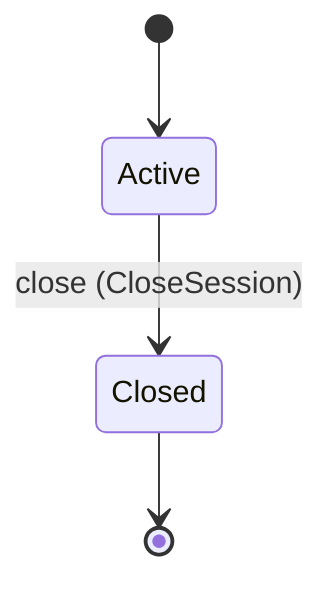

<!--
generated from agentide v1
model digest 509495079a366d767a747dbfcd22e419c28040b7ff32d15a1f284393168d16ab
contract digest 6eb89a5e515e8a94a30a5a8493662815a7cdf2595733f0ac1328a04054f122c9
do not edit: regenerate with `ess generate`
-->

# Sessions

The durable identity and observable projection of one coding session.

`agentide.session` is one of agentide's bounded contexts. [Back to the index](../index.md).

## Types

### `Cursor`

`agentide.session.Cursor` wraps `Integer` and is not interchangeable with one: the whole value of naming it separately is the crossings the model then refuses.

### `EventLimit`

`agentide.session.EventLimit` wraps `Integer` and is not interchangeable with one: the whole value of naming it separately is the crossings the model then refuses.

### `ManifestDigest`

`agentide.session.ManifestDigest` wraps `String` and is not interchangeable with one: the whole value of naming it separately is the crossings the model then refuses.

### `ProjectId`

`agentide.session.ProjectId` wraps `String` and is not interchangeable with one: the whole value of naming it separately is the crossings the model then refuses.

### `RequestId`

`agentide.session.RequestId` wraps `String` and is not interchangeable with one: the whole value of naming it separately is the crossings the model then refuses.

### `SessionId`

`agentide.session.SessionId` wraps `String` and is not interchangeable with one: the whole value of naming it separately is the crossings the model then refuses.

### `SessionScopes`

`agentide.session.SessionScopes` is a record of three fields:

- `principal` — `Optional<String>`, which may be absent
- `team` — `Optional<String>`, which may be absent
- `project` — `Optional<String>`, which may be absent

### `SourceRevision`

`agentide.session.SourceRevision` wraps `String` and is not interchangeable with one: the whole value of naming it separately is the crossings the model then refuses.

### `WorkspaceRoot`

`agentide.session.WorkspaceRoot` wraps `String` and is not interchangeable with one: the whole value of naming it separately is the crossings the model then refuses.

### `WorkspaceSessionId`

`agentide.session.WorkspaceSessionId` wraps `String` and is not interchangeable with one: the whole value of naming it separately is the crossings the model then refuses.

## Entities

An entity is what this context is about: something with an identity that outlives any one request, a shape, and a lifecycle. The lifecycle is exhaustive — a move that is not drawn below is a move this specification does not permit, and that is the only way it says so. Every move is labelled with the command that takes it, because a move nothing can trigger is refused rather than drawn.

### `CodingSession`

`agentide.session.CodingSession`.

An instance is identified by `session_id`, a `agentide.session.SessionId`. The name is part of the model and not a convention: a view projects the identity under that name, so a projection inventing its own would disagree with the view.

It holds:

- `workspace_root` — `agentide.session.WorkspaceRoot`
- `objective` — `String`
- `project_id` — `Optional<agentide.session.ProjectId>`, which may be absent
- `source_revision` — `Optional<agentide.session.SourceRevision>`, which may be absent
- `workspace_session_id` — `Optional<agentide.session.WorkspaceSessionId>`, which may be absent
- `manifest_digest` — `Optional<agentide.session.ManifestDigest>`, which may be absent
- `owner` — `String`
- `scopes` — `agentide.session.SessionScopes`

It declares no relation to another entity, and no other entity names it.

No invariant is declared, so nothing here constrains an instance at rest.

Its state is a `agentide.session.CodingSession.State`, one of `Active` and `Closed`. That enum is synthesised from the lifecycle rather than declared beside it, so the states a view's filter compares and the states drawn below cannot disagree.

An instance is created in `Active`. `Closed` is terminal, so an instance may rest there forever. That is declared rather than inferred from having no way out: an entity that cannot leave a state is either finished or stuck, and only its author knows which.

Each move is taken by a declared command outcome, and a move nothing takes is refused as `missing_causation` rather than left as a state change nobody can trigger:

- `close` — taken by `agentide.session.CloseSession` on its `closed` outcome

An instance is brought into existence by `agentide.session.EnsureHostedSession` on its `started` outcome and `agentide.session.StartSession` on its `started` outcome.

Illegal transitions are illegal by absence: no rule forbids them, there is simply no arrow, because a rule would be a second place for the same truth to live. A diagram cannot show an absence, so the pairs it does not connect are listed here, derived from the same transitions — anything named below is a move this specification does not permit.

- `Closed` may not become `Active`

One view projects it: [`SessionSnapshot`](#sessionsnapshot).

## Views

A view is what the outside world is promised it can observe. Each one says which instances it contains and how soon it reflects a command that has already returned, because "you can read this" without "how soon" is the promise every flaky suite is built on.

### `SessionSnapshot`

`agentide.session.SessionSnapshot`, shown to a person as "Session snapshot" and called `snapshot` on the wire.

It reads [`CodingSession`](#codingsession).

It contains every instance of that entity: no filter narrows it, which is a decision somebody made and not a line somebody omitted.

It exposes:

- `session_id` — `agentide.session.SessionId`
- `workspace_root` — `agentide.session.WorkspaceRoot`
- `objective` — `String`
- `project_id` — `Optional<agentide.session.ProjectId>`, which may be absent
- `source_revision` — `Optional<agentide.session.SourceRevision>`, which may be absent
- `workspace_session_id` — `Optional<agentide.session.WorkspaceSessionId>`, which may be absent
- `manifest_digest` — `Optional<agentide.session.ManifestDigest>`, which may be absent
- `owner` — `String`
- `scopes` — `agentide.session.SessionScopes`
- `state` — `agentide.session.CodingSession.State`

It declares no order, so the rows come back in whatever order the implementation has, and two reads may disagree.

**Read-your-writes**: it is current the moment the command that changed it returns. A caller that has just created an invoice and cannot see it in here has been told a lie about what it did.

A generated scenario asserts it once, immediately after the command: a view promising this and not keeping the promise has to fail the suite rather than be retried until it passes.

## Commands

### `CloseSession`

`agentide.session.CloseSession`, shown to a person as "Close session" and called `session-close` on the wire.

It takes:

- `session_id` — `agentide.session.SessionId`
- `request_id` — `agentide.session.RequestId`

It has three outcomes.

**`closed`** — The default branch, taken when no other outcome's condition matched. It moves a `agentide.session.CodingSession` from `Active` to `Closed`, along the declared move `close`. The instance is the one named by the input field `session_id`. It emits `agentide.session.SessionClosed`. A test reaches it by constructing an input that satisfies no other outcome's condition.

**`wrong-state`** — Taken when the subject is resting in a state none of this command's moves start from — a `agentide.session.CodingSession` in `Closed`, which is what is left of the lifecycle once this command's own moves are taken away. The document lists none of it. No entity in this specification changes. It reports `agentide.session.SessionStateConflict`, carrying `state`. It emits nothing. A test reaches it by driving an instance into one of those states and then issuing the command, because no input selects this branch.

**`refused`** — Decided outside the input: durable state cannot be updated. No predicate over the input reaches this branch, and saying `when: false` instead would have claimed it is unreachable, which is a different and false statement. No entity in this specification changes. It reports `agentide.session.SessionRefusal`, carrying `code`, `message` and `retryable`. It emits nothing. A test reaches it by injecting the declared fault, because no input can.

### `EnsureHostedSession`

`agentide.session.EnsureHostedSession`, shown to a person as "Ensure hosted session" and called `hosted-session-ensure` on the wire.

It takes:

- `session_id` — `agentide.session.SessionId`
- `workspace_root` — `agentide.session.WorkspaceRoot`
- `objective` — `String`
- `project_id` — `agentide.session.ProjectId`
- `source_revision` — `agentide.session.SourceRevision`
- `workspace_session_id` — `agentide.session.WorkspaceSessionId`
- `manifest_digest` — `agentide.session.ManifestDigest`
- `scopes` — `agentide.session.SessionScopes`

It has two outcomes.

**`started`** — The default branch, taken when no other outcome's condition matched. It creates a `agentide.session.CodingSession`, which starts in `Active`. The new instance's identity is published as `session_id` on `agentide.session.SessionStarted`. It emits `agentide.session.SessionStarted`. A test reaches it by constructing an input that satisfies no other outcome's condition.

**`refused`** — Decided outside the input: the hosted workspace or durable coordination binding is unavailable. No predicate over the input reaches this branch, and saying `when: false` instead would have claimed it is unreachable, which is a different and false statement. No entity in this specification changes. It reports `agentide.session.SessionRefusal`, carrying `code`, `message` and `retryable`. It emits nothing. A test reaches it by injecting the declared fault, because no input can.

### `ReadEvents`

`agentide.session.ReadEvents`, shown to a person as "Read session events" and called `event-read` on the wire.

It takes:

- `session_id` — `agentide.session.SessionId`
- `request_id` — `agentide.session.RequestId`
- `after` — `Optional<agentide.session.Cursor>`, which may be absent
- `limit` — `agentide.session.EventLimit`

It has two outcomes.

**`observed`** — The default branch, taken when no other outcome's condition matched. No entity in this specification changes. It emits `agentide.session.SessionObserved`. A test reaches it by constructing an input that satisfies no other outcome's condition.

**`refused`** — Decided outside the input: the requested event window cannot be represented. No predicate over the input reaches this branch, and saying `when: false` instead would have claimed it is unreachable, which is a different and false statement. No entity in this specification changes. It reports `agentide.session.SessionRefusal`, carrying `code`, `message` and `retryable`. It emits nothing. A test reaches it by injecting the declared fault, because no input can.

### `SnapshotSession`

`agentide.session.SnapshotSession`, shown to a person as "Snapshot session" and called `session-snapshot` on the wire.

It takes:

- `session_id` — `agentide.session.SessionId`
- `request_id` — `agentide.session.RequestId`

It has two outcomes.

**`observed`** — The default branch, taken when no other outcome's condition matched. No entity in this specification changes. It emits `agentide.session.SessionObserved`. A test reaches it by constructing an input that satisfies no other outcome's condition.

**`refused`** — Decided outside the input: the durable session cannot be read exactly. No predicate over the input reaches this branch, and saying `when: false` instead would have claimed it is unreachable, which is a different and false statement. No entity in this specification changes. It reports `agentide.session.SessionRefusal`, carrying `code`, `message` and `retryable`. It emits nothing. A test reaches it by injecting the declared fault, because no input can.

### `StartSession`

`agentide.session.StartSession`, shown to a person as "Start session" and called `session-start` on the wire.

It takes:

- `workspace_root` — `agentide.session.WorkspaceRoot`
- `objective` — `String`
- `project_id` — `Optional<agentide.session.ProjectId>`, which may be absent
- `source_revision` — `Optional<agentide.session.SourceRevision>`, which may be absent
- `workspace_session_id` — `Optional<agentide.session.WorkspaceSessionId>`, which may be absent
- `manifest_digest` — `Optional<agentide.session.ManifestDigest>`, which may be absent
- `scopes` — `agentide.session.SessionScopes`

It has two outcomes.

**`started`** — The default branch, taken when no other outcome's condition matched. It creates a `agentide.session.CodingSession`, which starts in `Active`. The new instance's identity is published as `session_id` on `agentide.session.SessionStarted`. It emits `agentide.session.SessionStarted`. A test reaches it by constructing an input that satisfies no other outcome's condition.

**`refused`** — Decided outside the input: the workspace or standalone binding is unavailable. No predicate over the input reaches this branch, and saying `when: false` instead would have claimed it is unreachable, which is a different and false statement. No entity in this specification changes. It reports `agentide.session.SessionRefusal`, carrying `code`, `message` and `retryable`. It emits nothing. A test reaches it by injecting the declared fault, because no input can.

## Events

### `SessionClosed`

`agentide.session.SessionClosed`.

It carries:

- `session_id` — `agentide.session.SessionId`

Emitted by `agentide.session.CloseSession` on its `closed` outcome.

Nothing in this system reacts to it.

### `SessionObserved`

`agentide.session.SessionObserved`.

It carries:

- `session_id` — `agentide.session.SessionId`
- `request_id` — `agentide.session.RequestId`

Emitted by `agentide.session.ReadEvents` on its `observed` outcome.

Emitted by `agentide.session.SnapshotSession` on its `observed` outcome.

Nothing in this system reacts to it.

### `SessionStarted`

`agentide.session.SessionStarted`.

It carries:

- `session_id` — `agentide.session.SessionId`
- `workspace_root` — `agentide.session.WorkspaceRoot`
- `objective` — `String`
- `project_id` — `Optional<agentide.session.ProjectId>`, which may be absent
- `source_revision` — `Optional<agentide.session.SourceRevision>`, which may be absent
- `workspace_session_id` — `Optional<agentide.session.WorkspaceSessionId>`, which may be absent
- `manifest_digest` — `Optional<agentide.session.ManifestDigest>`, which may be absent
- `owner` — `String`
- `scopes` — `agentide.session.SessionScopes`

Emitted by `agentide.session.EnsureHostedSession` on its `started` outcome.

Emitted by `agentide.session.StartSession` on its `started` outcome.

Nothing in this system reacts to it.

## Errors

### `SessionRefusal`

The session operation was not admitted or could not be observed exactly.

It carries:

- `code` — `String`
- `message` — `String`
- `retryable` — `Boolean`

Reported by `agentide.session.CloseSession` on its `refused` outcome.

Reported by `agentide.session.EnsureHostedSession` on its `refused` outcome.

Reported by `agentide.session.ReadEvents` on its `refused` outcome.

Reported by `agentide.session.SnapshotSession` on its `refused` outcome.

Reported by `agentide.session.StartSession` on its `refused` outcome.

### `SessionStateConflict`

The session is not in a state this command acts from.

It carries:

- `state` — `agentide.session.CodingSession.State`

Reported by `agentide.session.CloseSession` on its `wrong-state` outcome.

## Actors

An actor is who may ask this context for something. Every grant below points at a command this specification declares — a grant is a resolved reference, so "may invoke" something nobody wrote is not a permission this model can express, and an authorisation that authorises nothing cannot ship quietly.

### `CodingAgent`

`agentide.session.CodingAgent`, shown to a person as "Coding agent".

It may invoke [`ReadEvents`](#readevents) and [`SnapshotSession`](#snapshotsession).

### `Operator`

`agentide.session.Operator`, shown to a person as "Operator".

It may invoke [`CloseSession`](#closesession), [`EnsureHostedSession`](#ensurehostedsession) and [`StartSession`](#startsession).

---

Generated from agentide v1 · model digest `509495079a366d767a747dbfcd22e419c28040b7ff32d15a1f284393168d16ab` · contract digest `6eb89a5e515e8a94a30a5a8493662815a7cdf2595733f0ac1328a04054f122c9`. Do not edit this file; change the specification and regenerate it with `ess generate`.
