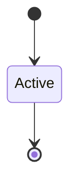

<!--
generated from agentide v1
model digest 509495079a366d767a747dbfcd22e419c28040b7ff32d15a1f284393168d16ab
contract digest 91570fc68352850104519423ede46a5eded913f94fb9d5488c253b21f052bc75
do not edit: regenerate with `ess generate`
-->

# Workspace surface

A renderer-neutral virtual workbench shared by agents, the browser, CLI snapshots, and the console TUI.

`agentide.surface` is one of agentide's bounded contexts. [Back to the index](../index.md).

## Types

### `PaneId`

`agentide.surface.PaneId` wraps `String` and is not interchangeable with one: the whole value of naming it separately is the crossings the model then refuses.

### `PaneKind`

`agentide.surface.PaneKind` is one of `Editor`, `Diff`, `Terminal`, `Chat`, `Timeline`, `Agents`, `Approvals` and `Evidence`.

### `PaneSnapshot`

`agentide.surface.PaneSnapshot` is a record of six fields:

- `id` — `agentide.surface.PaneId`
- `kind` — `agentide.surface.PaneKind`
- `title` — `String`
- `path` — `Optional<agentide.coding.Path>`, which may be absent
- `line` — `Optional<Integer>`, which may be absent
- `column` — `Optional<Integer>`, which may be absent

### `SplitDirection`

`agentide.surface.SplitDirection` is one of `Horizontal` and `Vertical`.

## Entities

An entity is what this context is about: something with an identity that outlives any one request, a shape, and a lifecycle. The lifecycle is exhaustive — a move that is not drawn below is a move this specification does not permit, and that is the only way it says so. Every move is labelled with the command that takes it, because a move nothing can trigger is refused rather than drawn.

### `Workbench`

`agentide.surface.Workbench`.

An instance is identified by `session_id`, a `agentide.session.SessionId`. The name is part of the model and not a convention: a view projects the identity under that name, so a projection inventing its own would disagree with the view.

It holds:

- `coding_session_id` — `agentide.session.SessionId`
- `panes` — `List<agentide.surface.PaneSnapshot>`
- `focused_pane` — `Optional<agentide.surface.PaneId>`, which may be absent
- `open_files` — `List<agentide.coding.Path>`
- `owner` — `String`
- `scopes` — `agentide.session.SessionScopes`

It references at most one [`agentide.session.CodingSession`](agentide-session.md#codingsession), as `session`, carried by `Workbench.coding_session_id`.

No invariant is declared, so nothing here constrains an instance at rest.

Its state is a `agentide.surface.Workbench.State`, one of `Active`. That enum is synthesised from the lifecycle rather than declared beside it, so the states a view's filter compares and the states drawn below cannot disagree.

An instance is created in `Active`. `Active` is terminal, so an instance may rest there forever. That is declared rather than inferred from having no way out: an entity that cannot leave a state is either finished or stuck, and only its author knows which.

It declares no moves, so nothing changes its state once it exists.

It has one state, so there is no move to permit or to forbid.

One view projects it: [`WorkbenchSnapshot`](#workbenchsnapshot).

## Views

A view is what the outside world is promised it can observe. Each one says which instances it contains and how soon it reflects a command that has already returned, because "you can read this" without "how soon" is the promise every flaky suite is built on.

### `WorkbenchSnapshot`

`agentide.surface.WorkbenchSnapshot`, shown to a person as "Workbench snapshot" and called `workbench` on the wire.

It reads [`Workbench`](#workbench).

It contains every instance of that entity: no filter narrows it, which is a decision somebody made and not a line somebody omitted.

It exposes:

- `session_id` — `agentide.session.SessionId`
- `coding_session_id` — `agentide.session.SessionId`
- `panes` — `List<agentide.surface.PaneSnapshot>`
- `focused_pane` — `Optional<agentide.surface.PaneId>`, which may be absent
- `open_files` — `List<agentide.coding.Path>`
- `owner` — `String`
- `scopes` — `agentide.session.SessionScopes`

It declares no order, so the rows come back in whatever order the implementation has, and two reads may disagree.

**Read-your-writes**: it is current the moment the command that changed it returns. A caller that has just created an invoice and cannot see it in here has been told a lie about what it did.

A generated scenario asserts it once, immediately after the command: a view promising this and not keeping the promise has to fail the suite rather than be retried until it passes.

## Commands

### `CloseFile`

`agentide.surface.CloseFile`, shown to a person as "Close file" and called `file-close` on the wire.

It takes:

- `session_id` — `agentide.session.SessionId`
- `request_id` — `agentide.session.RequestId`
- `path` — `agentide.coding.Path`
- `panes` — `List<agentide.surface.PaneSnapshot>`
- `focused_pane` — `Optional<agentide.surface.PaneId>`, which may be absent
- `open_files` — `List<agentide.coding.Path>`

It has two outcomes.

**`completed`** — The default branch, taken when no other outcome's condition matched. It changes a `agentide.surface.Workbench` without moving it along its lifecycle. The instance is the one named by the input field `session_id`. It emits `agentide.surface.FileClosed`. A test reaches it by constructing an input that satisfies no other outcome's condition.

**`refused`** — Decided outside the input: the requested surface state is unavailable. No predicate over the input reaches this branch, and saying `when: false` instead would have claimed it is unreachable, which is a different and false statement. No entity in this specification changes. It reports `agentide.surface.SurfaceFailure`, carrying `code`, `message` and `retryable`. It emits nothing. A test reaches it by injecting the declared fault, because no input can.

### `ClosePane`

`agentide.surface.ClosePane`, shown to a person as "Close pane" and called `pane-close` on the wire.

It takes:

- `session_id` — `agentide.session.SessionId`
- `request_id` — `agentide.session.RequestId`
- `pane_id` — `agentide.surface.PaneId`
- `panes` — `List<agentide.surface.PaneSnapshot>`
- `focused_pane` — `Optional<agentide.surface.PaneId>`, which may be absent
- `open_files` — `List<agentide.coding.Path>`

It has two outcomes.

**`completed`** — The default branch, taken when no other outcome's condition matched. It changes a `agentide.surface.Workbench` without moving it along its lifecycle. The instance is the one named by the input field `session_id`. It emits `agentide.surface.PaneClosed`. A test reaches it by constructing an input that satisfies no other outcome's condition.

**`refused`** — Decided outside the input: the requested surface state is unavailable. No predicate over the input reaches this branch, and saying `when: false` instead would have claimed it is unreachable, which is a different and false statement. No entity in this specification changes. It reports `agentide.surface.SurfaceFailure`, carrying `code`, `message` and `retryable`. It emits nothing. A test reaches it by injecting the declared fault, because no input can.

### `FocusPane`

`agentide.surface.FocusPane`, shown to a person as "Focus pane" and called `pane-focus` on the wire.

It takes:

- `session_id` — `agentide.session.SessionId`
- `request_id` — `agentide.session.RequestId`
- `pane_id` — `agentide.surface.PaneId`
- `panes` — `List<agentide.surface.PaneSnapshot>`
- `focused_pane` — `Optional<agentide.surface.PaneId>`, which may be absent
- `open_files` — `List<agentide.coding.Path>`

It has two outcomes.

**`completed`** — The default branch, taken when no other outcome's condition matched. It changes a `agentide.surface.Workbench` without moving it along its lifecycle. The instance is the one named by the input field `session_id`. It emits `agentide.surface.PaneFocused`. A test reaches it by constructing an input that satisfies no other outcome's condition.

**`refused`** — Decided outside the input: the requested surface state is unavailable. No predicate over the input reaches this branch, and saying `when: false` instead would have claimed it is unreachable, which is a different and false statement. No entity in this specification changes. It reports `agentide.surface.SurfaceFailure`, carrying `code`, `message` and `retryable`. It emits nothing. A test reaches it by injecting the declared fault, because no input can.

### `MoveCursor`

`agentide.surface.MoveCursor`, shown to a person as "Move editor cursor" and called `cursor-move` on the wire.

It takes:

- `session_id` — `agentide.session.SessionId`
- `request_id` — `agentide.session.RequestId`
- `pane_id` — `agentide.surface.PaneId`
- `path` — `agentide.coding.Path`
- `line` — `Integer`
- `column` — `Integer`
- `panes` — `List<agentide.surface.PaneSnapshot>`
- `focused_pane` — `Optional<agentide.surface.PaneId>`, which may be absent
- `open_files` — `List<agentide.coding.Path>`

It has two outcomes.

**`completed`** — The default branch, taken when no other outcome's condition matched. It changes a `agentide.surface.Workbench` without moving it along its lifecycle. The instance is the one named by the input field `session_id`. It emits `agentide.surface.CursorMoved`. A test reaches it by constructing an input that satisfies no other outcome's condition.

**`refused`** — Decided outside the input: the requested surface state is unavailable. No predicate over the input reaches this branch, and saying `when: false` instead would have claimed it is unreachable, which is a different and false statement. No entity in this specification changes. It reports `agentide.surface.SurfaceFailure`, carrying `code`, `message` and `retryable`. It emits nothing. A test reaches it by injecting the declared fault, because no input can.

### `OpenFile`

`agentide.surface.OpenFile`, shown to a person as "Open file" and called `file-open` on the wire.

It takes:

- `session_id` — `agentide.session.SessionId`
- `request_id` — `agentide.session.RequestId`
- `path` — `agentide.coding.Path`
- `line` — `Optional<Integer>`, which may be absent
- `pane_id` — `Optional<agentide.surface.PaneId>`, which may be absent
- `panes` — `List<agentide.surface.PaneSnapshot>`
- `focused_pane` — `Optional<agentide.surface.PaneId>`, which may be absent
- `open_files` — `List<agentide.coding.Path>`

It has two outcomes.

**`completed`** — The default branch, taken when no other outcome's condition matched. It changes a `agentide.surface.Workbench` without moving it along its lifecycle. The instance is the one named by the input field `session_id`. It emits `agentide.surface.FileOpened`. A test reaches it by constructing an input that satisfies no other outcome's condition.

**`refused`** — Decided outside the input: the requested surface state is unavailable. No predicate over the input reaches this branch, and saying `when: false` instead would have claimed it is unreachable, which is a different and false statement. No entity in this specification changes. It reports `agentide.surface.SurfaceFailure`, carrying `code`, `message` and `retryable`. It emits nothing. A test reaches it by injecting the declared fault, because no input can.

### `OpenPane`

`agentide.surface.OpenPane`, shown to a person as "Open pane" and called `pane-open` on the wire.

It takes:

- `session_id` — `agentide.session.SessionId`
- `request_id` — `agentide.session.RequestId`
- `pane_id` — `agentide.surface.PaneId`
- `kind` — `agentide.surface.PaneKind`
- `split` — `Optional<agentide.surface.SplitDirection>`, which may be absent
- `panes` — `List<agentide.surface.PaneSnapshot>`
- `focused_pane` — `Optional<agentide.surface.PaneId>`, which may be absent
- `open_files` — `List<agentide.coding.Path>`

It has two outcomes.

**`completed`** — The default branch, taken when no other outcome's condition matched. It changes a `agentide.surface.Workbench` without moving it along its lifecycle. The instance is the one named by the input field `session_id`. It emits `agentide.surface.PaneOpened`. A test reaches it by constructing an input that satisfies no other outcome's condition.

**`refused`** — Decided outside the input: the requested surface state is unavailable. No predicate over the input reaches this branch, and saying `when: false` instead would have claimed it is unreachable, which is a different and false statement. No entity in this specification changes. It reports `agentide.surface.SurfaceFailure`, carrying `code`, `message` and `retryable`. It emits nothing. A test reaches it by injecting the declared fault, because no input can.

### `ShowDiff`

`agentide.surface.ShowDiff`, shown to a person as "Show diff" and called `diff-show` on the wire.

It takes:

- `session_id` — `agentide.session.SessionId`
- `request_id` — `agentide.session.RequestId`
- `pane_id` — `Optional<agentide.surface.PaneId>`, which may be absent
- `path` — `Optional<agentide.coding.Path>`, which may be absent
- `base` — `Optional<String>`, which may be absent
- `panes` — `List<agentide.surface.PaneSnapshot>`
- `focused_pane` — `Optional<agentide.surface.PaneId>`, which may be absent
- `open_files` — `List<agentide.coding.Path>`

It has two outcomes.

**`completed`** — The default branch, taken when no other outcome's condition matched. It changes a `agentide.surface.Workbench` without moving it along its lifecycle. The instance is the one named by the input field `session_id`. It emits `agentide.surface.DiffShown`. A test reaches it by constructing an input that satisfies no other outcome's condition.

**`refused`** — Decided outside the input: the requested surface state is unavailable. No predicate over the input reaches this branch, and saying `when: false` instead would have claimed it is unreachable, which is a different and false statement. No entity in this specification changes. It reports `agentide.surface.SurfaceFailure`, carrying `code`, `message` and `retryable`. It emits nothing. A test reaches it by injecting the declared fault, because no input can.

### `SnapshotSurface`

`agentide.surface.SnapshotSurface`, shown to a person as "Snapshot workspace surface" and called `surface-snapshot` on the wire.

It takes:

- `session_id` — `agentide.session.SessionId`
- `request_id` — `agentide.session.RequestId`
- `panes` — `List<agentide.surface.PaneSnapshot>`
- `focused_pane` — `Optional<agentide.surface.PaneId>`, which may be absent
- `open_files` — `List<agentide.coding.Path>`

It has two outcomes.

**`completed`** — The default branch, taken when no other outcome's condition matched. It creates a `agentide.surface.Workbench`, which starts in `Active`. The new instance's identity is published as `session_id` on `agentide.surface.SurfaceObserved`. It emits `agentide.surface.SurfaceObserved`. A test reaches it by constructing an input that satisfies no other outcome's condition.

**`refused`** — Decided outside the input: the requested surface state is unavailable. No predicate over the input reaches this branch, and saying `when: false` instead would have claimed it is unreachable, which is a different and false statement. No entity in this specification changes. It reports `agentide.surface.SurfaceFailure`, carrying `code`, `message` and `retryable`. It emits nothing. A test reaches it by injecting the declared fault, because no input can.

## Events

### `CursorMoved`

`agentide.surface.CursorMoved`.

It carries:

- `session_id` — `agentide.session.SessionId`
- `pane_id` — `agentide.surface.PaneId`
- `line` — `Integer`
- `column` — `Integer`
- `panes` — `List<agentide.surface.PaneSnapshot>`
- `focused_pane` — `Optional<agentide.surface.PaneId>`, which may be absent
- `open_files` — `List<agentide.coding.Path>`

Emitted by `agentide.surface.MoveCursor` on its `completed` outcome.

Nothing in this system reacts to it.

### `DiffShown`

`agentide.surface.DiffShown`.

It carries:

- `session_id` — `agentide.session.SessionId`
- `pane_id` — `Optional<agentide.surface.PaneId>`, which may be absent
- `panes` — `List<agentide.surface.PaneSnapshot>`
- `focused_pane` — `Optional<agentide.surface.PaneId>`, which may be absent
- `open_files` — `List<agentide.coding.Path>`

Emitted by `agentide.surface.ShowDiff` on its `completed` outcome.

Nothing in this system reacts to it.

### `FileClosed`

`agentide.surface.FileClosed`.

It carries:

- `session_id` — `agentide.session.SessionId`
- `path` — `agentide.coding.Path`
- `panes` — `List<agentide.surface.PaneSnapshot>`
- `focused_pane` — `Optional<agentide.surface.PaneId>`, which may be absent
- `open_files` — `List<agentide.coding.Path>`

Emitted by `agentide.surface.CloseFile` on its `completed` outcome.

Nothing in this system reacts to it.

### `FileOpened`

`agentide.surface.FileOpened`.

It carries:

- `session_id` — `agentide.session.SessionId`
- `path` — `agentide.coding.Path`
- `pane_id` — `Optional<agentide.surface.PaneId>`, which may be absent
- `panes` — `List<agentide.surface.PaneSnapshot>`
- `focused_pane` — `Optional<agentide.surface.PaneId>`, which may be absent
- `open_files` — `List<agentide.coding.Path>`

Emitted by `agentide.surface.OpenFile` on its `completed` outcome.

Nothing in this system reacts to it.

### `PaneClosed`

`agentide.surface.PaneClosed`.

It carries:

- `session_id` — `agentide.session.SessionId`
- `pane_id` — `agentide.surface.PaneId`
- `panes` — `List<agentide.surface.PaneSnapshot>`
- `focused_pane` — `Optional<agentide.surface.PaneId>`, which may be absent
- `open_files` — `List<agentide.coding.Path>`

Emitted by `agentide.surface.ClosePane` on its `completed` outcome.

Nothing in this system reacts to it.

### `PaneFocused`

`agentide.surface.PaneFocused`.

It carries:

- `session_id` — `agentide.session.SessionId`
- `pane_id` — `agentide.surface.PaneId`
- `panes` — `List<agentide.surface.PaneSnapshot>`
- `focused_pane` — `Optional<agentide.surface.PaneId>`, which may be absent
- `open_files` — `List<agentide.coding.Path>`

Emitted by `agentide.surface.FocusPane` on its `completed` outcome.

Nothing in this system reacts to it.

### `PaneOpened`

`agentide.surface.PaneOpened`.

It carries:

- `session_id` — `agentide.session.SessionId`
- `pane_id` — `agentide.surface.PaneId`
- `kind` — `agentide.surface.PaneKind`
- `panes` — `List<agentide.surface.PaneSnapshot>`
- `focused_pane` — `Optional<agentide.surface.PaneId>`, which may be absent
- `open_files` — `List<agentide.coding.Path>`

Emitted by `agentide.surface.OpenPane` on its `completed` outcome.

Nothing in this system reacts to it.

### `SurfaceObserved`

`agentide.surface.SurfaceObserved`.

It carries:

- `session_id` — `agentide.session.SessionId`
- `coding_session_id` — `agentide.session.SessionId`
- `request_id` — `agentide.session.RequestId`
- `panes` — `List<agentide.surface.PaneSnapshot>`
- `focused_pane` — `Optional<agentide.surface.PaneId>`, which may be absent
- `open_files` — `List<agentide.coding.Path>`

Emitted by `agentide.surface.SnapshotSurface` on its `completed` outcome.

Nothing in this system reacts to it.

## Errors

### `SurfaceFailure`

The requested virtual-surface transition was refused or could not be projected.

It carries:

- `code` — `String`
- `message` — `String`
- `retryable` — `Boolean`

Reported by `agentide.surface.CloseFile` on its `refused` outcome.

Reported by `agentide.surface.ClosePane` on its `refused` outcome.

Reported by `agentide.surface.FocusPane` on its `refused` outcome.

Reported by `agentide.surface.MoveCursor` on its `refused` outcome.

Reported by `agentide.surface.OpenFile` on its `refused` outcome.

Reported by `agentide.surface.OpenPane` on its `refused` outcome.

Reported by `agentide.surface.ShowDiff` on its `refused` outcome.

Reported by `agentide.surface.SnapshotSurface` on its `refused` outcome.

## Actors

An actor is who may ask this context for something. Every grant below points at a command this specification declares — a grant is a resolved reference, so "may invoke" something nobody wrote is not a permission this model can express, and an authorisation that authorises nothing cannot ship quietly.

### `CodingAgent`

`agentide.surface.CodingAgent`.

It may invoke [`CloseFile`](#closefile), [`ClosePane`](#closepane), [`FocusPane`](#focuspane), [`MoveCursor`](#movecursor), [`OpenFile`](#openfile), [`OpenPane`](#openpane), [`ShowDiff`](#showdiff) and [`SnapshotSurface`](#snapshotsurface).

---

Generated from agentide v1 · model digest `509495079a366d767a747dbfcd22e419c28040b7ff32d15a1f284393168d16ab` · contract digest `91570fc68352850104519423ede46a5eded913f94fb9d5488c253b21f052bc75`. Do not edit this file; change the specification and regenerate it with `ess generate`.
