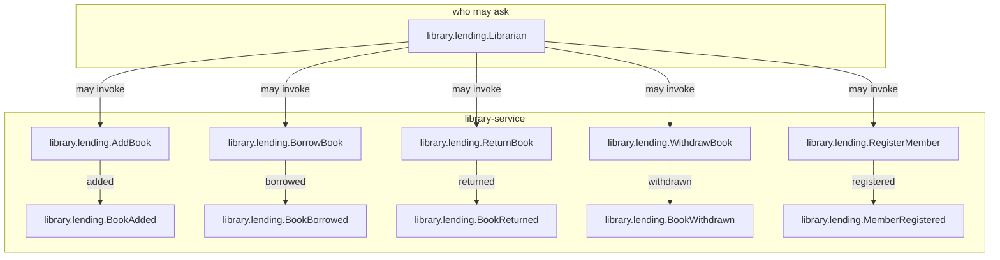

# Your first ESS specification

An **Executable System Specification** (ESS) says what a system does: its records, the commands that
change them, the answers a command may refuse with, the events it publishes and the views it serves.
The `ess` command-line tool checks that the specification is consistent, generates documentation and
an OpenAPI description from it, and writes a **conformance suite**: tests that any implementation,
in any language, must pass.

In this tutorial an agent writes the specification for you, you check it with `ess`, and a small Go
implementation is held to the suite. It takes about 30 minutes.

**What you end with:**

- a specification of a lending library in `spec/`, which `ess specify validate` accepts;
- documentation and an OpenAPI description generated from it;
- a Go implementation in `impl/` that passes all 17 scenarios the specification obliges;
- a check that fails when the implementation breaks a rule, which you will see happen.

Every output block on this page is what the command printed when this page was recorded, on
2026-09-28, with `ess` 0.38.0, the `ess` plugin from this marketplace and Go 1.27. Paths are
shortened to `~` for the home directory. The files are in the
[repository](https://github.com/beyond10x/agentplugins/tree/main/website/docs/tutorials/first-ess-specification);
copy them if you want to follow without an agent.

## What you need

- [Claude Code](https://docs.anthropic.com/en/docs/claude-code) or Codex.
- [Go](https://go.dev/dl/) 1.23 or newer, for step 6.
- An empty directory. This page uses `library/`.

## 1. Install `ess` and its plugin

Give your agent one sentence:

```text
Set up Beyond10x: follow https://github.com/beyond10x/agentplugins/releases/latest/download/SETUP.md
```

It installs the `b10x` setup tool and asks what you want to do; answer *write specifications*. It
lists every change before it makes one. If you prefer to run it
yourself, with `b10x` already on your `PATH`:

```shell-session
$ b10x init ess --host claude --out plan.json
```

```text
b10x setup plan (hosts: claude)

Products:
  [ ] aep         Plan governed work in an artifact store and deliver it in reviewed waves.
  [x] ess         Write, retrofit, validate and conformance-test Executable System Specifications.
  [ ] worktree    Create, lease, finish and safely clean isolated Git worktrees.
  [ ] connectors  Set up providers and invoke governed integrations through the connectors CLI.  (optional)

Findings:
  change claude b10x                             marketplace `b10x` is not registered; add beyond10x/agentplugins
  change claude b10x@b10x                        not installed; install 0.16.0
  change claude ess@b10x                         not installed; install 0.16.0
  change -      ess                              not on PATH; install the newest release 0.38.0
  note   -      install method                   prebuilt archives (cargo is on PATH); choose with --method cargo or --method prebuilt

Actions (4):
   1. register marketplace `b10x`: claude plugin marketplace add beyond10x/agentplugins
   2. install `b10x@b10x`: claude plugin install b10x@b10x --scope user
   3. install `ess@b10x`: claude plugin install ess@b10x --scope user
   4. install `ess`: install ess 0.38.0 into ~/.local/bin (prebuilt archive)

Next:
  /ess:init starts ess here (this session, before a restart: `b10x skill ess:init`)
  /b10x:upgrade checks everything later; /b10x:init adds a product

Apply after the user confirms this list: b10x setup apply --plan plan.json --yes
```

`b10x` shows the plan first and changes nothing. (This recording registered a local copy of the
marketplace; the lines above show the name yours registers, `beyond10x/agentplugins`.) Apply it
after you have read the list:

```shell-session
$ b10x setup apply --plan plan.json --yes
```

```text
snapshot: ~/.local/state/b10x/setup/1790586877
  ok   1/4 register marketplace `b10x`: claude plugin marketplace add beyond10x/agentplugins
  ok   2/4 install `b10x@b10x`: claude plugin install b10x@b10x --scope user
  ok   3/4 install `ess@b10x`: claude plugin install ess@b10x --scope user
  ok   4/4 install `ess`: install ess 0.38.0 into ~/.local/bin (prebuilt archive)

After:
b10x setup plan (hosts: claude)

Products:
  [ ] aep         Plan governed work in an artifact store and deliver it in reviewed waves.
  [x] ess         Write, retrofit, validate and conformance-test Executable System Specifications.  (present)
  [ ] worktree    Create, lease, finish and safely clean isolated Git worktrees.
  [ ] connectors  Set up providers and invoke governed integrations through the connectors CLI.  (optional)

Findings:
  ok     claude b10x@b10x                        current (0.16.0)
  ok     claude ess@b10x                         current (0.16.0)
  ok     -      ess                              0.38.0 at ~/.local/bin/ess is the newest release

Nothing to change.

Also runs (refreshes the marketplace snapshot; changes no version):
   - refresh: claude plugin marketplace update b10x

Next:
  /ess:init starts ess here (this session, before a restart: `b10x skill ess:init`)
  /b10x:upgrade checks everything later; /b10x:init adds a product

Converged. New plugins load in a new session: restart Claude Code (or /reload-plugins) or start a new Codex thread. In this session, `b10x skill <plugin>` lists a plugin's skills and `b10x skill <plugin>:<skill>` prints one.
```

Restart Claude Code so it loads the new plugin. The `ess` plugin gives the agent the
`ess:specifying` skill, which is what writes the specification in the next step.

## 2. Ask for the specification

Describe the system in plain words, and ask the agent to put its questions first:

```text
I want an ESS specification for a small lending library. The library adds books and registers
members. A member borrows a book and later returns it. A book that is on loan can't be lent again,
and a book can only be withdrawn from the collection while it is on the shelf. Put it in spec/.
Before you write anything, ask me the decisions you need from me, then stop and wait for my answers.
```

`ess:specifying` does not guess what your words mean. It asks the open decisions in numbered rounds,
each with the answer it would take, and it looks up anything it can find for itself. This is the
first round it asked, unedited:

<details>
<summary>The agent's questions (10)</summary>

The directory is empty and `ess` 0.38.0 is installed, so there is nothing existing to build on. Here's the first round of decisions. Each one has the answer I'd pick. Reply with the numbers you want to change, or "all recommended".

**Q1: Is a "book" a physical copy or a title?**
A copy means each physical item is tracked on its own. A title means one record per title, with its copies underneath.
*Recommended: a physical copy.* The request only talks about one book being on the shelf or on loan. Titles and copies would add an entity the request doesn't mention.

**Q2: Is a loan its own record, or just a state of the book?**
- **Own record:** a `Loan` entity that points to the book and the member, and goes from `Active` to `Returned`. This keeps a history of who borrowed what.
- **State only:** the book's state says `OnLoan` and stores who has it. There's no history.

*Recommended: its own record.* A borrow has to say who borrowed, and a loan record is the natural place to keep that.

**Q3: What states does a book go through?**
*Recommended:* it starts `OnShelf` when added. Borrowing moves it to `OnLoan`, and returning moves it back to `OnShelf`. Withdrawing moves it from `OnShelf` to `Withdrawn`. `Withdrawn` is final and the book is kept, not deleted. Borrowing a book that's on loan, or withdrawing one that's on loan, is refused with a named error.

**Q4: What does a book record?**
*Recommended:* `title` and `author` (both text), with a generated ID. Should there be an ISBN too?

**Q5: What does a member record, and can a member leave?**
*Recommended:* only `name`, with a generated ID. Members are registered and never cancelled, because the request doesn't mention leaving.

**Q6: Is there a limit on how many books a member can borrow at once?**
*Recommended: no limit.*

**Q7: Are there due dates or overdue loans?**
*Recommended: no.* A loan is just active until the book comes back.

**Q8: What does a return need?**
*Recommended: only the book.* Any active loan on that book is closed, and the returning member isn't checked. The other option is to require the loan ID or the member, and refuse it if they don't match.

**Q9: What can be looked up?**
*Recommended:*
- the catalogue: every book with its state
- the list of members
- the active loans

These lists are also what the conformance checks use to see the book, member and loan rules.

**Q10: Should the spec say how the library is reached, e.g. over HTTP?**
This is what lets me generate an OpenAPI description from the spec.
*Recommended: yes.* One library service, reached over HTTP.

I'll stop here until you answer. If any answer leads to a follow-up question (for example, an ISBN in Q4 raises whether it has to be unique), I'll ask that in a short second round before I write anything to `spec/`.

</details>

Answer the numbers you want to change. This page answered:

```text
All recommended, except Q2: state only. The book records which member has it; no separate loan
record. No ISBN. Go ahead: write the specification in spec/, validate it, and tell me what you wrote.
```

Q2 matters most. With a separate loan record, a borrow changes two records, and an ESS command
changes one; see [When a rule spans two records](#when-a-rule-spans-two-records) at the end.

The agent then wrote the specification, validated it and reported one decision back: the
specification cannot check that the member in `BorrowBook` is registered, because a command can only
be guarded by the record it acts on. This page answered *leave it to the implementation*, and the
agent recorded that as a comment on `BorrowBook`.

## 3. Read what it wrote

Four files; `validate` counts the three that make up the specification, and `ess-inputs.yaml` lists
them. `system.yaml` names the system and its one domain:

```yaml title="spec/system.yaml"
format: ess/15
system: library
version: v1

domains:
  - library.lending
```

`components.yaml` says which service accepts the commands and publishes the events. It is what lets
`ess` generate an OpenAPI description:

```yaml title="spec/components.yaml"
components:
  - component: library-service
    summary: Holds the collection and the members, and lends books to members.
    owns:
      domains:
        - library.lending
    accepts:
      commands:
        - library.lending.AddBook
        - library.lending.RegisterMember
        - library.lending.BorrowBook
        - library.lending.ReturnBook
        - library.lending.WithdrawBook
    publishes:
      events:
        - library.lending.BookAdded
        - library.lending.MemberRegistered
        - library.lending.BookBorrowed
        - library.lending.BookReturned
        - library.lending.BookWithdrawn
    reached_by: network
```

`ess-inputs.yaml` lists the files that make up the specification, so nothing generated is ever read
back in as input. Its `requires:` line pins the `ess` release; [step 8](#8-keep-it-true) explains it:

```yaml title="spec/ess-inputs.yaml"
format: ess-inputs/2
requires: ess 0.38.0
specification:
  - system.yaml
  - components.yaml
  - domains/lending.yaml
scenarios: []
```

`domains/lending.yaml` is the domain itself. Read it in this order:

- **`entities`**: `Book` and `Member`. A book's `lifecycle` lists its states (`OnShelf`, `OnLoan`,
  `Withdrawn`) and the three `transitions` between them. `borrower_id` is a `references` relation
  to `Member`: the book points at a member and does not own one.
- **`commands`**: each one has `outcomes`. `borrowed` moves the book through `lend`; `wrong-state`
  refuses with `BookStateConflict` when the book is not on the shelf. That refusal is the rule *a
  book on loan can't be lent again*, written once.
- **`events`** and **`views`**: what the service publishes, and what a caller can read back.

<details>
<summary>spec/domains/lending.yaml (the whole file)</summary>

```yaml title="spec/domains/lending.yaml"
domain: library.lending

summary: A small lending library. Books are added to the collection, members are registered, and a
  member borrows a book and later returns it.

naming:
  wire: lending
  display: Lending

types:
  - name: library.lending.BookId
    kind: newtype
    of: Uuid

  - name: library.lending.MemberId
    kind: newtype
    of: Uuid

entities:
  # One physical book. There is no loan record: while the book is OnLoan it records which member
  # has it, and the record is cleared when the book comes back.
  - name: library.lending.Book
    identity:
      name: book_id
      type: library.lending.BookId
    fields:
      - name: title
        type: String
      - name: author
        type: String
      - name: borrower_id
        type: Optional<library.lending.MemberId>
    relations:
      - name: borrower
        kind: references
        target: library.lending.Member
        cardinality: one
        via: borrower_id
    lifecycle:
      initial: OnShelf
      states: [OnShelf, OnLoan, Withdrawn]
      terminal: [Withdrawn]
      transitions:
        - name: lend
          from: [OnShelf]
          to: OnLoan
        - name: return
          from: [OnLoan]
          to: OnShelf
        - name: withdraw
          from: [OnShelf]
          to: Withdrawn

  # Members are registered and never leave.
  - name: library.lending.Member
    identity:
      name: member_id
      type: library.lending.MemberId
    fields:
      - name: name
        type: String
    lifecycle:
      initial: Active
      states: [Active]
      terminal: [Active]

actors:
  - name: library.lending.Librarian
    may:
      - library.lending.AddBook
      - library.lending.RegisterMember
      - library.lending.BorrowBook
      - library.lending.ReturnBook
      - library.lending.WithdrawBook
    naming:
      display: Librarian

errors:
  - name: library.lending.BookStateConflict
    summary: The book is not in a state this command acts from, so nothing changed.
    fields:
      - name: state
        type: library.lending.Book.State

  - name: library.lending.BookNotFound
    summary: No book in the collection has this identity.
    fields:
      - name: book_id
        type: library.lending.BookId

commands:
  - name: library.lending.AddBook
    naming:
      wire: add-book
      display: Add a book
    input:
      - name: title
        type: String
      - name: author
        type: String
    outcomes:
      - name: added
        creates: library.lending.Book
        instance: book_id
        sets:
          title: input.title
          author: input.author
          borrower_id: {cleared: true}
        emits:
          - library.lending.BookAdded
        payload:
          library.lending.BookAdded:
            book_id: {generated: true}
            title: input.title
            author: input.author
        summary: The book is in the collection, on the shelf.

  - name: library.lending.RegisterMember
    naming:
      wire: register-member
      display: Register a member
    input:
      - name: name
        type: String
    outcomes:
      - name: registered
        creates: library.lending.Member
        instance: member_id
        sets:
          name: input.name
        emits:
          - library.lending.MemberRegistered
        payload:
          library.lending.MemberRegistered:
            member_id: {generated: true}
            name: input.name
        summary: The member is registered and may borrow.

  - name: library.lending.BorrowBook
    naming:
      wire: borrow-book
      display: Borrow a book
    input:
      - name: book_id
        type: library.lending.BookId
      - name: member_id
        type: library.lending.MemberId
    # The borrowing member must be a registered member. That is a condition on another entity
    # (Member), which a command outcome cannot guard on. Decided: the implementation checks it;
    # this specification does not, and no scenario covers it.
    outcomes:
      - name: borrowed
        moves: library.lending.Book.lend
        instance: book_id
        sets:
          borrower_id: input.member_id
        emits:
          - library.lending.BookBorrowed
        payload:
          library.lending.BookBorrowed:
            book_id: input.book_id
            member_id: input.member_id
        summary: The book is on loan to the member.

      - name: wrong-state
        wrong_state: true
        error: library.lending.BookStateConflict
        summary: The book is on loan or withdrawn, so it was not lent.

      - name: no-such-book
        unknown_instance: true
        error: library.lending.BookNotFound
        summary: No book has this identity, so nothing was lent.

  # A return names only the book; the member who brings it back is not checked.
  - name: library.lending.ReturnBook
    naming:
      wire: return-book
      display: Return a book
    input:
      - name: book_id
        type: library.lending.BookId
    outcomes:
      - name: returned
        moves: library.lending.Book.return
        instance: book_id
        sets:
          borrower_id: {cleared: true}
        emits:
          - library.lending.BookReturned
        payload:
          library.lending.BookReturned:
            book_id: input.book_id
        summary: The book is back on the shelf and no member has it.

      - name: wrong-state
        wrong_state: true
        error: library.lending.BookStateConflict
        summary: The book is not on loan, so nothing was returned.

      - name: no-such-book
        unknown_instance: true
        error: library.lending.BookNotFound
        summary: No book has this identity, so nothing was returned.

  - name: library.lending.WithdrawBook
    naming:
      wire: withdraw-book
      display: Withdraw a book
    input:
      - name: book_id
        type: library.lending.BookId
    outcomes:
      - name: withdrawn
        moves: library.lending.Book.withdraw
        instance: book_id
        emits:
          - library.lending.BookWithdrawn
        payload:
          library.lending.BookWithdrawn:
            book_id: input.book_id
        summary: The book has left the collection for good.

      - name: wrong-state
        wrong_state: true
        error: library.lending.BookStateConflict
        summary: The book is on loan or already withdrawn, so it was not withdrawn.

      - name: no-such-book
        unknown_instance: true
        error: library.lending.BookNotFound
        summary: No book has this identity, so nothing was withdrawn.

events:
  - name: library.lending.BookAdded
    fields:
      - name: book_id
        type: library.lending.BookId
      - name: title
        type: String
      - name: author
        type: String

  - name: library.lending.MemberRegistered
    fields:
      - name: member_id
        type: library.lending.MemberId
      - name: name
        type: String

  - name: library.lending.BookBorrowed
    fields:
      - name: book_id
        type: library.lending.BookId
      - name: member_id
        type: library.lending.MemberId

  - name: library.lending.BookReturned
    fields:
      - name: book_id
        type: library.lending.BookId

  - name: library.lending.BookWithdrawn
    fields:
      - name: book_id
        type: library.lending.BookId

views:
  # The whole collection, in every state, with who has each book.
  - name: library.lending.Catalogue
    source: library.lending.Book
    consistency: read_your_writes
    fields:
      - name: book_id
        type: library.lending.BookId
      - name: title
        type: String
      - name: author
        type: String
      - name: state
        type: library.lending.Book.State
      - name: borrower_id
        type: Optional<library.lending.MemberId>
    naming:
      wire: catalogue
      display: Catalogue

  - name: library.lending.Members
    source: library.lending.Member
    consistency: read_your_writes
    fields:
      - name: member_id
        type: library.lending.MemberId
      - name: name
        type: String
    naming:
      wire: members
      display: Members

  # The loans in force: every book on loan and the member who has it.
  - name: library.lending.BooksOnLoan
    source: library.lending.Book
    consistency: read_your_writes
    filter: state == OnLoan
    fields:
      - name: book_id
        type: library.lending.BookId
      - name: title
        type: String
      - name: borrower_id
        type: Optional<library.lending.MemberId>
    naming:
      wire: books-on-loan
      display: Books on loan
```

</details>

## 4. Validate it

```shell-session
$ ess specify validate --path spec
```

```text
library v1 — 3 file(s), valid
```

Now make a mistake, to see what a refusal looks like. In `BorrowBook`, change
`moves: library.lending.Book.lend` to `moves: library.lending.Book.loan`, a transition that does not
exist, and validate again:

```text
$ ess specify validate --path spec
spec was refused:
  - [undeclared_reference] command.library.lending.BorrowBook.outcomes.borrowed.moves: outcome `borrowed` of `library.lending.BorrowBook` takes `loan`, which `library.lending.Book` does not declare as a transition (hint: `library.lending.Book` declares: lend, return, withdraw)
  - [missing_causation] entity library.lending.Book.transitions[0]: `lend` moves `library.lending.Book` to `OnLoan`, and no command outcome takes it, so nothing in this specification can make that state change happen (hint: give some outcome `moves: library.lending.Book.lend`, or delete the transition)
  - error[ESS-COMMAND-001]: outcome `borrowed` of `library.lending.BorrowBook` takes `loan`, which `library.lending.Book` does not declare as a transition
  `ess-domain` refuses this as `undeclared_reference`
  help: `library.lending.Book` declares: lend, return, withdraw
  --> domains/lending.yaml:139:5
  - error[ESS-ENTITY-005]: `lend` moves `library.lending.Book` to `OnLoan`, and no command outcome takes it, so nothing in this specification can make that state change happen
  `ess-domain` refuses this as `missing_causation`
  help: give some outcome `moves: library.lending.Book.lend`, or delete the transition
  --> domains/lending.yaml:22:5
```

It names the file, the line where the declaration starts, what is wrong, and what the book does
declare. It also reports the
consequence: nothing takes the `lend` transition any more. Change it back, and `validate` prints
`valid` again.

## 5. Generate from it

The same specification produces documentation and an OpenAPI description:

```shell-session
$ ess generate --kind openapi --path spec --out out
$ ess generate --kind docs --path spec --out out
```

```text
openapi/library-service.yaml — 25269 byte(s)
1 artifact(s), written to out
docs/crossings.md — 1204 byte(s)
docs/domains/library-lending.md — 16915 byte(s)
docs/index.md — 3379 byte(s)
docs/interactions.md — 1318 byte(s)
docs/topology.md — 1076 byte(s)
5 artifact(s), written to out
```

`ess specify graph --path spec --format mermaid` draws who may send which command and what each one
publishes:



## 6. Hold an implementation to it

Generate the conformance suite as a Go package inside the implementation's module:

```shell-session
$ ess verify conform synthesize --path spec --target go --out impl
```

```text
17 scenario(s) (0 authored), 0 refusal(s), 7 file(s) written to impl
```

`0 refusal(s)` means every rule in the specification became a check. A refusal would name a rule the
suite cannot test; read those before trusting a green run.

The package, `impl/essconform`, holds the scenarios and a runner. You supply a `Target`: the methods
that let the runner send a command to your implementation and read a view back. Ask the agent:

```text
Write a minimal in-memory Go implementation of the library in impl/ (module example.com/library)
that implements the suite's Target, and run `go test ./...` in impl/. Don't edit the generated
suite to make it pass.
```

It wrote three files: `go.mod`, `library.go` (the library) and `conformance_test.go` (the `Target`,
mapping the five commands and three views onto the library).

<details>
<summary>impl/library.go</summary>

```go title="impl/library.go"
// Package library is a minimal in-memory lending library: books are added and withdrawn, members
// are registered, and a member borrows a book and returns it.
package library

import (
	"crypto/rand"
	"errors"
	"fmt"
)

// BookState is where a book is in its lifecycle.
type BookState string

const (
	OnShelf   BookState = "OnShelf"
	OnLoan    BookState = "OnLoan"
	Withdrawn BookState = "Withdrawn"
)

// Book is one physical book. Borrower is set only while the book is OnLoan.
type Book struct {
	ID       string
	Title    string
	Author   string
	State    BookState
	Borrower *string
}

// Member is a registered member.
type Member struct {
	ID   string
	Name string
}

// ErrBookNotFound is returned when no book has the given identity.
var ErrBookNotFound = errors.New("book not found")

// ErrUnknownMember is returned when a borrow names a member nobody registered.
var ErrUnknownMember = errors.New("member not registered")

// StateConflictError is returned when a book is not in a state the operation acts from.
type StateConflictError struct {
	State BookState
}

func (e *StateConflictError) Error() string {
	return fmt.Sprintf("book is %s", e.State)
}

// Library holds the collection and the members in memory. It is not safe for concurrent use.
type Library struct {
	books   map[string]*Book
	members map[string]*Member
	// order keeps listings stable in insertion order.
	bookOrder   []string
	memberOrder []string
}

// New returns an empty library.
func New() *Library {
	return &Library{books: map[string]*Book{}, members: map[string]*Member{}}
}

// AddBook puts a new book on the shelf.
func (l *Library) AddBook(title, author string) Book {
	b := &Book{ID: newID(), Title: title, Author: author, State: OnShelf}
	l.books[b.ID] = b
	l.bookOrder = append(l.bookOrder, b.ID)
	return *b
}

// RegisterMember registers a new member.
func (l *Library) RegisterMember(name string) Member {
	m := &Member{ID: newID(), Name: name}
	l.members[m.ID] = m
	l.memberOrder = append(l.memberOrder, m.ID)
	return *m
}

// Borrow lends a book on the shelf to a member.
//
// requireMember makes an unregistered member a refusal. The specification leaves that check to the
// implementation and its conformance suite borrows for members it never registered, so the
// conformance target turns it off.
func (l *Library) Borrow(bookID, memberID string, requireMember bool) error {
	b, ok := l.books[bookID]
	if !ok {
		return ErrBookNotFound
	}
	if b.State != OnShelf {
		return &StateConflictError{State: b.State}
	}
	if requireMember {
		if _, ok := l.members[memberID]; !ok {
			return ErrUnknownMember
		}
	}
	b.State = OnLoan
	b.Borrower = &memberID
	return nil
}

// Return puts a book on loan back on the shelf.
func (l *Library) Return(bookID string) error {
	b, ok := l.books[bookID]
	if !ok {
		return ErrBookNotFound
	}
	if b.State != OnLoan {
		return &StateConflictError{State: b.State}
	}
	b.State = OnShelf
	b.Borrower = nil
	return nil
}

// Withdraw takes a book on the shelf out of the collection for good.
func (l *Library) Withdraw(bookID string) error {
	b, ok := l.books[bookID]
	if !ok {
		return ErrBookNotFound
	}
	if b.State != OnShelf {
		return &StateConflictError{State: b.State}
	}
	b.State = Withdrawn
	return nil
}

// Books lists every book, in every state.
func (l *Library) Books() []Book {
	out := make([]Book, 0, len(l.bookOrder))
	for _, id := range l.bookOrder {
		out = append(out, *l.books[id])
	}
	return out
}

// Members lists every member.
func (l *Library) Members() []Member {
	out := make([]Member, 0, len(l.memberOrder))
	for _, id := range l.memberOrder {
		out = append(out, *l.members[id])
	}
	return out
}

func newID() string {
	var b [16]byte
	if _, err := rand.Read(b[:]); err != nil {
		panic(err)
	}
	b[6] = b[6]&0x0f | 0x40
	b[8] = b[8]&0x3f | 0x80
	return fmt.Sprintf("%x-%x-%x-%x-%x", b[0:4], b[4:6], b[6:8], b[8:10], b[10:16])
}
```

</details>

<details>
<summary>impl/conformance_test.go</summary>

```go title="impl/conformance_test.go"
package library_test

import (
	"errors"
	"fmt"
	"os"
	"testing"

	"example.com/library"
	"example.com/library/essconform"
)

func TestConformance(t *testing.T) {
	// The suite runs only once a report format is chosen; choose it here so plain `go test ./...`
	// runs it. ESS_REPORT_OUT, when set, still decides where the report goes.
	if os.Getenv("ESS_REPORT_FORMAT") == "" {
		t.Setenv("ESS_REPORT_FORMAT", "2")
	}
	essconform.Run(t, func() essconform.Target { return newTarget() })
}

// target drives one in-memory Library through the suite's Target interface.
type target struct {
	lib *library.Library
}

func newTarget() *target { return &target{lib: library.New()} }

func (t *target) Identity() (essconform.Identity, error) {
	return essconform.Identity{Name: "example.com/library", Version: "v1"}, nil
}

func (t *target) BeginScenario(essconform.ScenarioContext) error { return nil }
func (t *target) EndScenario(essconform.ScenarioContext) error   { return nil }

func (t *target) ExecuteCommand(req essconform.CommandRequest) (essconform.CommandResult, error) {
	in := func(name string) (string, error) {
		v, ok := req.Input[name].(string)
		if !ok {
			return "", fmt.Errorf("%s: input %q is not text", req.Command, name)
		}
		return v, nil
	}
	event := func(name string, payload map[string]essconform.Node) []essconform.ObservedEvent {
		return []essconform.ObservedEvent{{Event: name, Payload: payload}}
	}

	switch req.Command {
	case "library.lending.AddBook":
		title, err := in("title")
		if err != nil {
			return essconform.CommandResult{}, err
		}
		author, err := in("author")
		if err != nil {
			return essconform.CommandResult{}, err
		}
		b := t.lib.AddBook(title, author)
		return essconform.CommandResult{
			Outcome: "added",
			DirectEvents: event("library.lending.BookAdded", map[string]essconform.Node{
				"book_id": b.ID, "title": b.Title, "author": b.Author,
			}),
		}, nil

	case "library.lending.RegisterMember":
		name, err := in("name")
		if err != nil {
			return essconform.CommandResult{}, err
		}
		m := t.lib.RegisterMember(name)
		return essconform.CommandResult{
			Outcome: "registered",
			DirectEvents: event("library.lending.MemberRegistered", map[string]essconform.Node{
				"member_id": m.ID, "name": m.Name,
			}),
		}, nil

	case "library.lending.BorrowBook":
		bookID, err := in("book_id")
		if err != nil {
			return essconform.CommandResult{}, err
		}
		memberID, err := in("member_id")
		if err != nil {
			return essconform.CommandResult{}, err
		}
		// The member check is the implementation's own rule, outside the specification; the
		// suite borrows for members it never registered, so it is off here.
		if err := t.lib.Borrow(bookID, memberID, false); err != nil {
			return refusal(err)
		}
		return essconform.CommandResult{
			Outcome: "borrowed",
			DirectEvents: event("library.lending.BookBorrowed", map[string]essconform.Node{
				"book_id": bookID, "member_id": memberID,
			}),
		}, nil

	case "library.lending.ReturnBook":
		bookID, err := in("book_id")
		if err != nil {
			return essconform.CommandResult{}, err
		}
		if err := t.lib.Return(bookID); err != nil {
			return refusal(err)
		}
		return essconform.CommandResult{
			Outcome:      "returned",
			DirectEvents: event("library.lending.BookReturned", map[string]essconform.Node{"book_id": bookID}),
		}, nil

	case "library.lending.WithdrawBook":
		bookID, err := in("book_id")
		if err != nil {
			return essconform.CommandResult{}, err
		}
		if err := t.lib.Withdraw(bookID); err != nil {
			return refusal(err)
		}
		return essconform.CommandResult{
			Outcome:      "withdrawn",
			DirectEvents: event("library.lending.BookWithdrawn", map[string]essconform.Node{"book_id": bookID}),
		}, nil
	}
	return essconform.CommandResult{}, fmt.Errorf("unknown command %q: %w", req.Command, essconform.ErrUnsupported)
}

// refusal maps a library error onto the declared outcome and error.
func refusal(err error) (essconform.CommandResult, error) {
	var conflict *library.StateConflictError
	switch {
	case errors.As(err, &conflict):
		return essconform.CommandResult{Outcome: "wrong-state", Error: "library.lending.BookStateConflict"}, nil
	case errors.Is(err, library.ErrBookNotFound):
		return essconform.CommandResult{Outcome: "no-such-book", Error: "library.lending.BookNotFound"}, nil
	}
	return essconform.CommandResult{}, err
}

func (t *target) QueryView(req essconform.ViewRequest) (essconform.ViewResult, error) {
	var rows []essconform.Row
	switch req.View {
	case "library.lending.Catalogue":
		for _, b := range t.lib.Books() {
			rows = append(rows, essconform.Row{
				"book_id": b.ID, "title": b.Title, "author": b.Author,
				"state": string(b.State), "borrower_id": borrower(b),
			})
		}
	case "library.lending.BooksOnLoan":
		for _, b := range t.lib.Books() {
			if b.State == library.OnLoan {
				rows = append(rows, essconform.Row{
					"book_id": b.ID, "title": b.Title, "borrower_id": borrower(b),
				})
			}
		}
	case "library.lending.Members":
		for _, m := range t.lib.Members() {
			rows = append(rows, essconform.Row{"member_id": m.ID, "name": m.Name})
		}
	default:
		return essconform.ViewResult{}, fmt.Errorf("unknown view %q: %w", req.View, essconform.ErrUnsupported)
	}
	return essconform.ViewResult{Rows: rows}, nil
}

func borrower(b library.Book) essconform.Node {
	if b.Borrower == nil {
		return nil
	}
	return *b.Borrower
}

// Every event is returned directly by the command that emits it; there is nothing to observe apart.
func (t *target) ObserveEvents(essconform.EventObservationRequest) ([]essconform.ObservedEvent, error) {
	return nil, essconform.ErrUnsupported
}

func (t *target) ConfigureExternalOutcome(essconform.ExternalOutcomeControl) error {
	return essconform.ErrUnsupported
}

func (t *target) RedeliverEvent(essconform.RedeliveryRequest) error {
	return essconform.ErrUnsupported
}

func (t *target) ObserveInvocations(essconform.InvocationObservationRequest) ([]essconform.Invocation, error) {
	return nil, essconform.ErrUnsupported
}
```

</details>

Run the suite. The runner needs `ESS_REPORT_FORMAT=2` and stops before the first scenario without
it. This `conformance_test.go` sets it when it is missing; in your own test, set it the same way or
on the command line.

```shell-session
$ cd impl
$ ESS_REPORT_FORMAT=2 go test -v ./...
```

```text
--- PASS: TestConformance (0.01s)
    --- PASS: TestConformance/library.lending.AddBook/outcome/added (0.00s)
    --- PASS: TestConformance/library.lending.Book/state/OnLoan/refuses/library.lending.BorrowBook (0.00s)
    --- PASS: TestConformance/library.lending.Book/state/OnLoan/refuses/library.lending.WithdrawBook (0.00s)
    --- PASS: TestConformance/library.lending.Book/state/OnShelf/refuses/library.lending.ReturnBook (0.00s)
    --- PASS: TestConformance/library.lending.Book/state/Withdrawn/refuses/library.lending.BorrowBook (0.00s)
    --- PASS: TestConformance/library.lending.Book/state/Withdrawn/refuses/library.lending.ReturnBook (0.00s)
    --- PASS: TestConformance/library.lending.Book/state/Withdrawn/refuses/library.lending.WithdrawBook (0.00s)
    --- PASS: TestConformance/library.lending.Book/transition/lend/by/library.lending.BorrowBook/borrowed (0.00s)
    --- PASS: TestConformance/library.lending.Book/transition/return/by/library.lending.ReturnBook/returned (0.00s)
    --- PASS: TestConformance/library.lending.Book/transition/withdraw/by/library.lending.WithdrawBook/withdrawn (0.00s)
    --- PASS: TestConformance/library.lending.BorrowBook/outcome/borrowed (0.00s)
    --- PASS: TestConformance/library.lending.BorrowBook/outcome/no-such-book (0.00s)
    --- PASS: TestConformance/library.lending.RegisterMember/outcome/registered (0.00s)
    --- PASS: TestConformance/library.lending.ReturnBook/outcome/no-such-book (0.00s)
    --- PASS: TestConformance/library.lending.ReturnBook/outcome/returned (0.00s)
    --- PASS: TestConformance/library.lending.WithdrawBook/outcome/no-such-book (0.00s)
    --- PASS: TestConformance/library.lending.WithdrawBook/outcome/withdrawn (0.00s)
PASS
ok  	example.com/library	0.017s
?   	example.com/library/essconform	[no test files]
```

Seventeen scenarios, each named for the rule it checks, for example
`library.lending.Book/state/OnLoan/refuses/library.lending.BorrowBook`.

## 7. Watch it catch a bug

A passing suite only means something if it can fail. In `impl/library.go`, make `Borrow` accept a
book that is already on loan:

```diff
-	if b.State != OnShelf {
+	if b.State == Withdrawn {
```

```shell-session
$ ESS_REPORT_FORMAT=2 go test ./...
```

```text
--- FAIL: TestConformance (0.04s)
    conformance_test.go:19: library v1, 17 scenario(s), spec digest 297bae6c872cfd3000a51c7ee9caa176be4674b27863f83233cb1af4c98e693d
    --- FAIL: TestConformance/library.lending.Book/state/OnLoan/refuses/library.lending.BorrowBook (0.00s)
        runtime.go:1870: `library.lending.BorrowBook` does not move a `library.lending.Book` that is in `OnLoan`, and reports `library.lending.BookStateConflict`
        runtime.go:2661: step 10: `library.lending.BorrowBook` took `borrowed`, and the specification says `wrong-state`
FAIL
FAIL	example.com/library	0.046s
?   	example.com/library/essconform	[no test files]
FAIL
```

The failing scenario names the rule, the step, and what the implementation did instead
(`took borrowed`, where the specification says `wrong-state`). Undo the change and the suite passes
again.

To test the suite itself, rather than one bug you thought of, the `ess:hardening` skill runs
`ess verify conform mutate`: it changes the specification one rule at a time and checks that the
suite notices each change.

## 8. Keep it true

Pin the `ess` release the specification was written against. The `ess-inputs.yaml` in step 3
already carries the pin; on your own project, add `requires:`, which needs `format: ess-inputs/2`:

```yaml title="spec/ess-inputs.yaml"
format: ess-inputs/2
requires: ess 0.38.0
```

```shell-session
$ cd spec && ess specify toolchain which
```

```text
ess 0.38.0
reason: pin: `requires: ess 0.38.0` in ~/library/spec/ess-inputs.yaml
binary: ~/.local/bin/ess (this ess)
```

With the pin, an `ess` of a different release runs 0.38.0 for this project, and
`ess specify toolchain install` fetches it where it is missing.

Then make the three checks part of your build, so a change to the specification or the code that
breaks the other fails there. With [Task](https://taskfile.dev):

```yaml title="Taskfile.yml"
version: '3'

tasks:
  check:
    cmds:
      - ess specify validate --path spec
      - ess verify conform synthesize --path spec --target go --out impl
      - cmd: go test ./...
        dir: impl
    env:
      ESS_REPORT_FORMAT: '2'
```

Regenerating the suite in the build means a changed specification is always tested as it now reads.

## When a rule spans two records

The first recording of this page asked for one more rule: *a member can hold at most three books at
a time*, with a separate loan record. The agent's model was valid, but each borrow became three
commands (one per record it changes: the member's count, the book, the loan), and synthesis refused
3 scenarios with `ESS-SYNTH-003`, because it cannot arrange a member who already holds three books.
The agent said so in its report instead of bending the model to make the number zero.

That is how ESS treats a rule across two records today: one command changes one record, and a check
it cannot build is named, not skipped in silence. When your domain has such a rule, expect the agent
to show you the split and the refusals, and decide with it whether the rule belongs in the
specification or in the implementation.

## Next

- **Plan work around it.** [Your first governed plan](./first-governed-plan.md) continues with this
  library: AEP plans a new feature, four critics review the plan, and the first story is built in a
  reviewed wave.
- **Specify a system that already runs.** `ess:retrofitting` derives a specification from an OpenAPI
  document or from code, citing a source for every declaration.
- **Go deeper into ESS.** The [ESS documentation](https://beyond10x.github.io/docs/ess/) covers the
  format, every command and the other targets (`--target typescript`).
